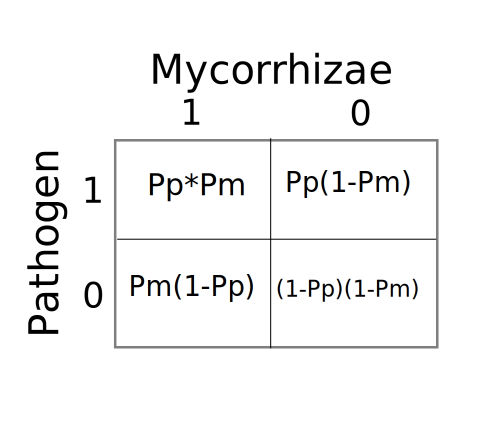

```{r setup, include=FALSE}
knitr::opts_chunk$set(echo = TRUE)
```

# 1. Simulating data

A simulation is a very handy method to use when generating toy data for generating model predictions or when
trying to understand the performance of statistical models. In fact, modern statistics publications often use simulations to test the validity of statistical models under different assumptions of the data (e.g. non-random sampling, heteroskedasticity).

Let's consider an experiment testing the effect of garlic mustard on the root colonization beneficial mycorrhizal fungi, conducted at Queen's University Biological Station (QUBS). In this experiment, 6 different native __species__ were found to grow <strong>in</strong>side or <strong>out</strong>side of garlic mustard populations, at each of 11 __locations__. Roots from each species were harvested to look at colonization by beneficial <strong>Myco</strong>rrhizae and <strong>path</strong>ogens.

Our goal here is to simulate data, which we will use first to generate model predictions, and then to test the performance of generalized linear mixed models.

## Model Predictions

### Hypothesis 1

__Hypothesis 1:__ Mycorrhizal colonization protects roots from lesions at the point of colonization, resulting in a negative correlation between the two. 

To create a model, we will simulate roots of individual plants. %Myc and %Path are calculated by examining 100 root cross-sections. We can simulate each cross-section with a probability of finding (or not finding) the other as a joint probability.

```{r}
NXsec<-100 # Number of cross-sections per plant
NPlants<-1000 # Number of plants
Pm<-0.2 # Probability of Mycorrhizae colonizing any given x-section
Pp<-Pm # Probability of Pathogens colonizing any give x-section 
Pc<-0.5 # Probability of finding Pathogens given Mycorrhizae have colonized at the same cross section. Interference if Pc < 1, facilitation if Pc > 1. The value of 0.5 means Pathogens have only half the expected colonization rate when Mycorrhizae are present.
Root<-data.frame(Myc=rep(NA,NPlants),Path=rep(NA,NPlants)) # Data for saving output
for(Pl in 1:NPlants){
  tempMyc<-sample(1:0,NXsec,replace=T,prob=c(Pm,1-Pm)) # Generate Myc colonization
  tempPath<-rep(NA,NXsec) # Empty vector of pathogen infection

  # Simulate root cross-sections. 
  if(length(tempPath[tempMyc==0])>0){
    tempPath[tempMyc==0]<-sample(1:0,length(tempPath[tempMyc==0]),replace=T,prob=c(Pp,1-Pp))  
  }
  if(length(tempPath[tempMyc==1])>0){
    tempPath[tempMyc==1]<-sample(1:0,length(tempPath[tempMyc==1]),replace=T,prob=c(Pp*Pc,1-Pp*Pc))
  }

  # Calculate % colonization
  Root$Myc[Pl]<-sum(tempMyc)
  Root$Path[Pl]<-sum(tempPath)
  
  # Clear temporary vectors to avoid errors in future iterations
  tempMyc<-tempPath<-NA
}
head(Root)
```

Compare means and run a linear model.
```{r}
mean(Root$Myc)
mean(Root$Path)
summary(lm(Path~Myc,data=Root))
```

Plot the % colonization of the simulated plants
```{r}
library(ggplot2)
qplot(Myc,Path,data=Root,alpha=I(0.3))+theme_bw()+geom_smooth(method="lm")
```

Note that the slope of the line at the whole-plant level is much less steep than in our model at the individual point of colonization within a plant's root. In our original model, pathogen colonization was reduced by half (20%-->1%) if Mycorrhizae had already colonized the same root cross-section. Therefore we might predict that a 1% increase in Mycorrhizal colonization at the whole-plant level would reduce Pathogen colonization by 0.5%. Compare the slope of the linear model (above) to the prediction of -0.5

### Hypothesis 2

__Hypothesis 2:__ Garlic mustard reduces mycorrhizal colonization (Pm) but not affect pathogen colonization (Pp) or the interaction between Mycorrhizae and pathogens (Pc).

By changing these parameters we can simulate 'high' garlic mustard densities vs. 'low' density or absence. The easiest way to do this is to move the code above into a function, add a 'return' statement, and then run it for different parameters representing the two cases. 

```{r}
GMsim<-function(NXsec=100,NPlants=1000,Pm=0.2,Pp=0.2,Pc=0.5){
  Root<-data.frame(Myc=rep(NA,NPlants),Path=rep(NA,NPlants)) # Data for saving output
  for(i in 1:NPlants){
    tempMyc<-sample(1:0,NXsec,replace=T,prob=c(Pm,1-Pm)) # Generate Myc colonization
    tempPath<-rep(NA,NXsec) # Empty vector of pathogen infection

    # Simulate root cross-sections. 
    if(length(tempPath[tempMyc==0])>0){
      tempPath[tempMyc==0]<-sample(1:0,length(tempPath[tempMyc==0]),replace=T,prob=c(Pp,1-Pp))  
    }
    if(length(tempPath[tempMyc==1])>0){
      tempPath[tempMyc==1]<-sample(1:0,length(tempPath[tempMyc==1]),replace=T,prob=c(Pp*Pc,1-Pp*Pc))
    }

    # Calculate % colonization
    Root$Myc[i]<-sum(tempMyc)
    Root$Path[i]<-sum(tempPath)
    
    # Clear temporary vectors to avoid errors in future iterations
    tempMyc<-tempPath<-NA
  }
  return(Root) ## Don't forget to return this to the user!
}
```

Now it's a simple matter of calling the function with new parameters. Since we put the original values as default parameters, we only need to change Pm.

```{r}
GMlow<-GMsim()
GMhigh<-GMsim(Pm=0.1)
# Add labels and combine for analysis & visualization
GMhigh$Dens<-"High"
GMlow$Dens<-"Low"
simDat<-rbind(GMlow,GMhigh)
head(simDat)
```

> Predict what the plot will look like (means and slope for each group)

Analyze results and plot. 
```{r}
summary(lm(Path~Myc*Dens,data=simDat))
qplot(Myc,Path,data=simDat,colour=Dens,alpha=I(0.3))+theme_bw()+geom_smooth(method="lm")
```

> Note the significant slope, but no significant effect of density. Why?

### Hypothesis 3

__Hypothesis 3:__ Garlic mustard reduces mycorrhizal colonization (Pm) AND weakens the interaction between Mycorrhizae and pathogens (Pc).

In terms of our simulation model, this means the same as Hypothesis #2 with the added effect that when Mycorrhizae are present, pathogens have higher probability of colonizing (i.e. __Pc__ closer to __Pp__).

Again, this is easily accomplished by tweaking parameters. In this example we will keep the same __Pm__ and __Pp__ values from the previous model and increase (double) the __Pc__ for the high-density GM model.
```{r}
GMlow<-GMsim(Pm=0.2,Pc=0.5) # Same parameters as above
GMhigh<-GMsim(Pm=0.1,Pc=1) # When GM is high: Myc colonize at 50% the rate and don't affect Pathogen colonization
# Add labels and combine for analysis & visualization
GMhigh$Dens<-"High"
GMlow$Dens<-"Low"
simDat<-rbind(GMlow,GMhigh)
# Analyze and plot
summary(lm(Path~Myc*Dens,data=simDat))
qplot(Myc,Path,data=simDat,colour=Dens,alpha=I(0.3))+theme_bw()+geom_smooth(method="lm")
```

You should see different slopes, and depeding on your simulated values you may even see a positive slope in the high-density case.

# 2. Simulations for Statistical Models

Now what if you wanted to check the __performance__ of the simple linear model we have been using? By __performance__ I mean the ability to detect an effect when present and reject when not present? For example, using the P < 0.05 convention we might want to check if the Type I error rate is <= 0.05% while also minimizing the Type II error rate for a range of parameter values. We can do this with a nested simulation:

  1. Run our simulated data for a given set of parameter values
  2. Run the linear model and extract the relvant P-value
  3. Repeat N times
  4. Examine the distribution of P-values  
  and/or
  5. Sort P-values and check # simulations where P < 0.05
  
To do this for the parameters/model above, we put the code into another `for` loop and save the P-values to a data.frame. 

> WARNING: This could take a while to run. Explain why.

```{r}
Loops<-100
Pout<-data.frame(Myc=rep(NA,Loops),Dens=rep(NA,Loops),Int=rep(NA,Loops))
for(i in 1:Loops){
GMlow<-GMsim(Pm=0.2,Pc=0.5)
GMhigh<-GMsim(Pm=0.1,Pc=1)
  # Add labels and combine for analysis & visualization
  GMhigh$Dens<-"High"
  GMlow$Dens<-"Low"
  simDat<-rbind(GMlow,GMhigh)
  # Analyze and save
  Pout[i,]<-summary(lm(Path~Myc*Dens,data=simDat))$coefficients[14:16]
}
head(Pout)
```

## Type II Error Rates

Calculate false-negative rates as the proportion of simulations with P > 0.05
```{r}
sum(Pout$Myc>0.05)/length(Pout$Myc) # Mycorrhizae effect
sum(Pout$Dens>0.05)/length(Pout$Dens) # GM Density Effect
sum(Pout$Int>0.05)/length(Pout$Int) # Interaction Effect
```

> What do these error rates mean? What does this tell us about the lm() model we are using

Plot the distribution of P-values from each factor, with a reference line at P < 0.05
```{r}
qplot(Myc,data=Pout)+geom_vline(aes(xintercept=0.05),colour="red")+theme_bw() # Distribution of P-values for Myc slope
qplot(Dens,data=Pout)+geom_vline(aes(xintercept=0.05),colour="red")+theme_bw() # Distribution of P-values for GM density effect
qplot(Int,data=Pout)+geom_vline(aes(xintercept=0.05),colour="red")+theme_bw() # Distribution of P-values for density*Myc interaction
```

Our Type II error rates tell us the `lm()` model is failing to reject the null for the interaction term about 50% of the time and Myc and Dens main effects about 90% the time!  Without any parameter differences we should get a P-value greater than 0.05 about 95% of the time. The `lm()` model is essentially garbage for detecting the effect that we are simulating.

> How would we test Type I Error Rates?

## Type I Error Rates

Type I error occurs when a statistical model rejects a null hypothesis even though it is true. By convention, it is more desirable for statistical tests to decrease Type I error at the expense of increasing Type II error.

To test Type I error, we simply set parameters to values that represent no effect. That is, Pm=Pc and the same parameters for GMhigh and GMlow
```{r}
Loops<-100
Pout<-data.frame(Myc=rep(NA,Loops),Dens=rep(NA,Loops),Int=rep(NA,Loops))
for(i in 1:Loops){
  GMhigh<-GMsim(Pc=1)
  GMlow<-GMsim(Pc=1)
  # Add labels and combine for analysis & visualization
  GMhigh$Dens<-"High"
  GMlow$Dens<-"Low"
  simDat<-rbind(GMlow,GMhigh)
  # Analyze and save
  Pout[i,]<-summary(lm(Path~Myc*Dens,data=simDat))$coefficients[14:16]
}
head(Pout)
```

The Type I Error rates occur when P < 0.05, which we expect to occur in about 5% of simulations, just by chance.

```{r}
sum(Pout$Myc<0.05)/length(Pout$Myc) # Mycorrhizae effect
sum(Pout$Dens<0.05)/length(Pout$Dens) # GM Density Effect
sum(Pout$Int<0.05)/length(Pout$Int) # Interaction Effect
```

> What do these error rates mean? What does this tell us about the lm() model we are using?

These Type I Error rates are about what we expect.

# 3. Nested(Nested(Sim))

Now imagine you wanted to test the Type II error rates of the `lm()` across a range of parameter values. For example, we might want to test:

  1. Is it better to measure more individual plants, or more cross-sections per plant?
  2. Are Type II errors more common when overall colonization rates (Pm==Pp) are low?
  3. Do interactions increase Type II error rates?

These are just 3 examples that we may come up with. To answer these, we can wrap our simulated simulations inside another simulation. Let's do this for the 3rd example. We could try to put the above simulation inside another function, and run again for a range of paramter values. But let's keep it simple and just compare cases with and without interactions

```{r}
Loops<-100
PoutNoInt<-data.frame(Myc=rep(NA,Loops),Dens=rep(NA,Loops),Int=rep(NA,Loops))
for(i in 1:Loops){
  GMlow<-GMsim(Pm=0.2,Pc=0.5)
  GMhigh<-GMsim(Pm=0.1,Pc=0.5)
  # Add labels and combine for analysis & visualization
  GMhigh$Dens<-"High"
  GMlow$Dens<-"Low"
  simDat<-rbind(GMlow,GMhigh)
  # Analyze and save
  PoutNoInt[i,]<-summary(lm(Path~Myc*Dens,data=simDat))$coefficients[14:16]
}
Loops<-100
PoutInt<-data.frame(Myc=rep(NA,Loops),Dens=rep(NA,Loops),Int=rep(NA,Loops))
for(i in 1:Loops){
  GMlow<-GMsim(Pm=0.2,Pc=0.5)
  GMhigh<-GMsim(Pm=0.1,Pc=1)
  # Add labels and combine for analysis & visualization
  GMhigh$Dens<-"High"
  GMlow$Dens<-"Low"
  simDat<-rbind(GMlow,GMhigh)
  # Analyze and save
  PoutInt[i,]<-summary(lm(Path~Myc*Dens,data=simDat))$coefficients[14:16]
}
```

Now compare the Type II Error rates. 
```{r}
cat("Error rates for No-Interaction Model\n",
      "Myc:",sum(PoutNoInt$Myc>0.05)/length(PoutNoInt$Myc),"\n",
      "Dens:",sum(PoutNoInt$Dens>0.05)/length(PoutNoInt$Dens),"\n",
    "Error rates for Interaction Model\n",
      "I-Myc:",sum(PoutInt$Myc>0.05)/length(PoutInt$Myc),"\n",
      "I-Dens:",sum(PoutInt$Dens>0.05)/length(PoutInt$Dens),"\n",
      "I-Int:",sum(PoutInt$Int>0.05)/length(PoutInt$Int),"\n")
```

Here we can see that the `lm()` test still under-performs (Type II >> 0.05), but also that the biological interaction reduces the ability of `lm()` to detect the Mycorrhizal effect (I-Myc >> Myc). 

A nice next-step could be to calculate error rates across a range of sample sizes and effect sizes and visualize the results. For example, instead of just interactions vs no-interaction you might imagine plots of error rates separately for each of the three parameters (Myc, Dens, Int), with each graph having:

  * __x-axis:__ Difference or ratio of Pm in high vs. low GM density
  * __y-axis:__ Difference or ratio of Pc in high vs. low GM density
  * __z-axis:__ (i.e. colour or point size): Error rate

# 4. Better Statistics

Now that simulations show us that we should avoid `lm()` models, we might want to rethink our analysis. One option would be to try more complicated models like Generalized Linear Models (GLM) or Generalized Mixed Models (GLMM). But those can take a long time to run -- to long to try our simulations. It would help to first think about why `lm()` is performing so poorly.

By collapsing all of the root cross-sections to a single value (% colonization), we lose the associations at the root intersection level. Therefore, instead of measuring % colonization, we can try to infer colonization probabilities and the interference term directly from the data.

Consider a 2x2 contingency table of presence/absence probabilities under the assumption of no interactions between Mycorrhizae and Pathogens:



If there is an interaction between Mycorrhizal and pathogen colonization, then we expect to see a deviation due to interference of Mycorrhizae on Pathogens, but we might also want to consider the reverse -- interference of pathogens on Mycorrhizal colonization. We can roughly estimate an interference parameter (I) as a deviation in the number of co-occurrance observations from the Pp*Pm prediction. We can then test whether I is significantly different from zero, and whether it differs in high vs. low GM patches.

There are some nuanced problems with this approach, but we can always use simulation models to test the performance of this new model to see if we are missing something important.

## Modified function

We have to modify our custom function to keep track of I instead of % colonization of roots:
```{r}
GMIsim<-function(NXsec=100,NPlants=1000,Pm=0.2,Pp=0.2,Pc=0.5){
  Ivals<-data.frame(I=rep(NA,NXsec)) # Vector for saving output
  for(i in 1:NPlants){
    tempMyc<-sample(1:0,NXsec,replace=T,prob=c(Pm,1-Pm)) # Generate Myc colonization
    tempPath<-rep(NA,NXsec) # Empty vector of pathogen infection

    # Simulate root cross-sections. 
    if(length(tempPath[tempMyc==0])>0){
      tempPath[tempMyc==0]<-sample(1:0,length(tempPath[tempMyc==0]),replace=T,prob=c(Pp,1-Pp))  
    }
    if(length(tempPath[tempMyc==1])>0){
      tempPath[tempMyc==1]<-sample(1:0,length(tempPath[tempMyc==1]),replace=T,prob=c(Pp*Pc,1-Pp*Pc))
    }

    # Count # categories
    tempMPobs<-sum(tempMyc==1 & tempPath==1) # Count of observed co-occurrences
    # Number of prediced co-occrrences is a bit tricky. 
    ## 1. Sum each sole occurrence and divide by total observations to calculate individual probabilities
    ## 2. Multiply probabilities together to calculate predicted joint probability
    ## 3. Multiply by total N observations to calculate predicted number of co-occurrences
    tempMPpred<-sum(tempMyc==1 & tempPath==0)*sum(tempMyc==0 & tempPath==1)/NXsec 
    # Now calculate I as the deviation of observed from predicted
    
    # Calculate I
    if(tempMPpred > 0){ # Avoid errors when tempMPpred == 0
      Ivals[i,]<-tempMPobs/tempMPpred  
    }
    
    
    # Clear temporary vectors to avoid errors in future iterations
    tempMyc<-tempPath<-tempMPobs<-tempMPpred<-NA
  }
  return(Ivals)
}
```

## Type II Error Rates

Let's test the Type II Error Rates for the new model, given how poorly the old `lm()` version performed. Note that we have to modify the new `lm()` for the interaction parameter (I), then run the loop and check the Type II error rate. If it still doesn't look good, we can write a bootstrap/null model for the I-statistic.
```{r}
Loops<-100
Pout<-data.frame(Int0=rep(NA,Loops),Dens=rep(NA,Loops))
for(i in 1:Loops){
  GMhigh<-GMIsim(Pm=0.1,Pc=0.5)
  GMlow<-GMIsim(Pm=0.2,Pc=1)
  # Add labels and combine for analysis & visualization
  GMhigh$Dens<-"High"
  GMlow$Dens<-"Low"
  simDat<-rbind(GMlow,GMhigh)
  # Analyze and save
  Pout[i,]<-summary(lm(I~Dens,data=simDat))$coefficients[7:8]
}
head(Pout)
```

Calculate false-negative rates as the proportion of simulations with P > 0.05. 
```{r}
sum(Pout$Int0>0.05)/length(Pout$Int0) # Test of whether I is different from zero
sum(Pout$Dens>0.05)/length(Pout$Dens) # Test if I differs for high vs low GM
```

Now we are getting no Type II errors at all -- no false negatives. That means the Type II error rate is < 0.01 (less than 1 in 100 simulated results). We could increase the number of simulations to 1000 or 10000 but it will take a while to run, so we won't do it here.

> IMPORTANT: The interepretation of these parameters is different from the previous lm(). Explain why.

Plot the distribution of P-values from each factor, with a reference line at P < 0.05
```{r}
qplot(Int0,data=Pout)+geom_vline(aes(xintercept=0.05),colour="red")+theme_bw() # Distribution of P-values
qplot(Dens,data=Pout)+geom_vline(aes(xintercept=0.05),colour="red")+theme_bw() # Distribution of P-values
```

## Type I Error Rates

We should check Type I error rates too. 
```{r}
Loops<-100
Pout<-data.frame(Int0=rep(NA,Loops),Dens=rep(NA,Loops))
for(i in 1:Loops){
  GMhigh<-GMIsim(Pc=1)
  GMlow<-GMIsim(Pc=1)
  # Add labels and combine for analysis & visualization
  GMhigh$Dens<-"High"
  GMlow$Dens<-"Low"
  simDat<-rbind(GMlow,GMhigh)
  # Analyze and save
  Pout[i,]<-summary(lm(I~Dens,data=simDat))$coefficients[7:8]
}
head(Pout)
```

Calculate false-positive rates as the proportion of simulations with P < 0.05. 
```{r}
sum(Pout$Int0<0.05)/length(Pout$Int0) # Test of whether I is different from zero
sum(Pout$Dens<0.05)/length(Pout$Dens) # Test if I differs for high vs low GM
```

Now there is a low false-positive rate when testing whether I differs, but a high rate when testing whether I is different from zero. 

Plot the distribution of P-values from each factor, with a reference line at P < 0.05
```{r}
qplot(Int0,data=Pout)+geom_vline(aes(xintercept=0.05),colour="red")+theme_bw() # Distribution of P-values
qplot(Dens,data=Pout)+geom_vline(aes(xintercept=0.05),colour="red")+theme_bw() # Distribution of P-values
```

This approach with `lm()` appears to work pretty well if we want to test whether I differs between populations, but not if we want to check if I is different from 0. For that, we may want to write a bootstrap/null model function instead.

## Bootstrap null model

```{r}
Mboot<-function(simDatI=NA,Iters=1000){
  nullI<-rep(NA,Iters)
  for (i in 1:Iters){
    nullI[i]<-mean(sample(simDatI,length(simDatI),replace=T))
  }
  # 2-tailed test
  P<-sum(abs(nullI) > mean(simDatI))/Iters
  if(P > 0){
    return(P)
  } else {
    return(1/Iters)
  }
}
```

Now run the bootstrap in place of the `lm()`. This may be a bit slow given the number of iterations in all of the simulations.
```{r}
Loops<-100
Pout<-data.frame(Int0=rep(NA,Loops))
for(i in 1:Loops){
  GMhigh<-GMIsim(Pc=1)
  GMlow<-GMIsim(Pc=1)
  # Add labels and combine for analysis & visualization
  GMhigh$Dens<-"High"
  GMlow$Dens<-"Low"
  simDat<-rbind(GMlow,GMhigh)
  # Analyze and save
  Pout[i,]<-Mboot(simDatI=simDat$I)
}
head(Pout)
```
```{r}
sum(Pout$Int0<0.05)/length(Pout$Int0) # Test of whether I is different from zero
qplot(Int0,data=Pout)+geom_vline(aes(xintercept=0.05),colour="red")+theme_bw() # Distribution of P-values
```

With the bootstrap model, we now have a Type I error rate < 0.01. Let's think about why the `lm()` didn't work but the bootstrap did. 

It will help to take a look at the raw data, by running one iteration of the loop and examinig the raw data (mean I values) instead of the P values from the `lm()`.

```{r}
GMhigh<-GMIsim(Pc=1)
GMlow<-GMIsim(Pc=1)
# Add labels and combine for analysis & visualization
GMhigh$Dens<-"High"
GMlow$Dens<-"Low"
simDat<-rbind(GMlow,GMhigh)
# Analyze and save

qplot(I,data=simDat,fill=Dens)+theme_bw()
```

Re-run the above script a few times to look at distributions from the simulations.

> What do you notice about the distribution? What does it suggest about testing the significance of I with linear models vs. bootstrap?

# 5. Constrained values

Recall that ___I___ is a ratio (observed/predicted). This is a good example of __constrained data__ because a ratio of count data can never be less than zero. By generating a null distribution above, we circumvented this problem. Another approach is to take the log of the ratio (log-odds ratio). This is equivalent to log(observed) - log(predicted) and since log of values < 1 are negative, the distribution should have better properties. We can either do this in a new function, or just transform the values after calling the function.

```{r}
qplot(log(I+1)-1,data=simDat,fill=Dens)+theme_bw() # Note log(I+1) to account for obs=0, and then subtract 1 to centre mean back at zero
```

> Exercise: Write a simulation to test the Type I and Type II errors on this new log-scale variable: log(I)

# 9. Permutation Test

The permutation test is a good alternative to the null distribution. The principal is very similar, but instead of resampling the raw data and re-calculating a mean or effect size, we resample the data and run a statistical model each time. The null distribution is then built from the F-value or other parameter from the statistical test.

First, generate 1 iteration of random data:
```{r}
GMhigh<-GMIsim(Pc=1)
GMlow<-GMIsim(Pc=1)
# Add labels and combine for analysis & visualization
GMhigh$Dens<-"High"
GMlow$Dens<-"Low"
simDat<-rbind(GMlow,GMhigh)
```

Permute by re-shuffling Density labels, running `lm()` and recording the F-statistic
```{r}
X<-summary(lm(I~Dens,data=simDat))$fstatistic[1]
Iters<-100
Xperm<-rep(NA,Iters)
for(i in 1:Iters){
  simDens<-sample(simDat$Dens,nrow(simDat),replace=F)
  Xperm[i]<-summary(lm(simDat$I~simDens))$fstatistic[1]
}

sum(X>Xperm)/Iters # P-value
qplot(Xperm)+geom_vline(aes(xintercept=0.05),colour="red")+theme_bw()
```

The `lmPerm` package does this for `lm()`, saving a few lines of code:
```{r}
library(lmPerm)
X<-summary(lm(I~Dens,data=simDat))$fstatistic[1]
Xperm<-summary(lmp(I~Dens,data=simDat),perm="Prob")
```

> Exercise: Test the Type I and Type II errors for the the two ways of doing a permutation test described above. Compare the errors from the two methods.

# 6. Make it faster

Once you understand the basic coding for bootraps and permutation tests, you can look into available packages to reduce the amount of code you need to write and have them run faster. 

The `lmPerm` package is the permutation equivalent of `lm()`

The `boot` package has tools for writing bootstrap models

The `foreach` and `doParallel` packages allow you to use multithreading in your functions and for-loops.


