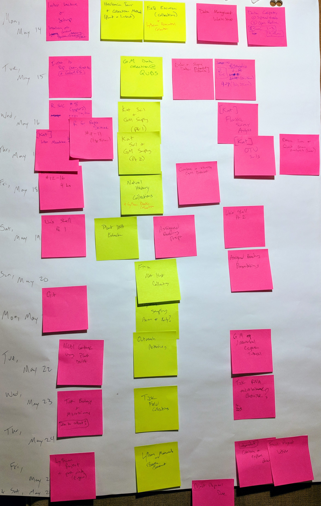

This is a 2-week __INTENSIVE__ field course. Intensive means your typical schedule will look like this:

| Time  | Activity    |
|-------|-------------|
| 07:30 | Breakfast |
| 08:30 | Morning Tutorials |
| 10:30 | Field Activities (Pack Lunch) |
| 17:30 | Dinner |
| 18:30 | Evening Tutorials |
| 21:30 | Finish |

# Schedule & Grades {.tabset .tabset-fade .tabset-pills} 

## Deadlines

Check back regularly; these will be updated as the schedule gets set:

| Date | Assignment |
|------------------|----------------------------------|
| May 16 (8:30)    | Submit paper choices |
| May 17 (8:30)    | Bring samples for DNA extraction |
| May 18 (evening) | 1. Finish collections  2. Combine & visualize GM dataset  3. Present assigned readings |

## DRAFT Schedule

This schedule is __tentative__:

## Grading Scheme

Note: This grading scheme has changed from the [OUPFB Syllabus](http://www.oupfb.ca/2018_modules/module18.pdf).

The main reason is to shorten the final project and replace it with two smaller projects that can be completed during the field course. This also reduces the amount of work to be completed after the field course has finished.

__Group Projects (50%)__ 

  * Herbarium Collections (10) -- Due May 20
  * Insect Collections (10) -- Due May 20
  * Final Project (30)
    + Project Proposal (5) -- Due May 26
    + Code and Data Quality (10) -- Due June 10
    + Final write-up (15) -- Due June 10

__Peer Evaluation & Participation (20%)__ 

__Individual Marks (30%)__

  * Field & Lab notes (10)
  * Paper Presentation 1 -- May 20 
  * Paper Presentation 2 -- May 22

## Grading Rubrics

### Natural History Collections

Each group member should produce at least 5 specimens. Submit 5 from each group member and note 'best' 5 (must include at least 1 from each group member). Grading will be based on:

  1. __Variety (10 marks)__ -- specimens differ from other students, represent a broad range of taxonomic groups, geographical locations, and habitat types.
  2. __Metadata (20 marks)__ -- labels with correct scientific name, GPS location and datum type; clear & detailed meta-data demonstrating careful observations.
  3. __Preservation (10 marks)__ -- specimen dried sufficiently, mounted properly, all structures visible (e.g. beetle wings extended; both sides of leaves visible), tidy and aesthetic presentation, secure mounting.

### Paper presentations

15 minute presentations + 5 minutes for questions & discussion. Grade (10%) based on
  
  1. __Content (20 marks)__ -- Presentation is an accurate representation of the paper. No important points are left out. 
  2. __Clarity (10 marks)__ -- Paper is explained well; complex or detailed material is summarized clearly; questions are answered well 
  3. __Presentation (10 marks)__ -- clean, clear slides; good eye contact; speaking at a good pace with good projection.

# 

***

# Tutorials & Activities {.tabset .tabset-fade .tabset-pills} 

## Tutorials

Datasets:

  * Spreadsheet Tutorial [Data](./FieldMethods/Data/survey_data_spreadsheet_messy.csv)  
  * OpenRefine Tutorial [Data](./FieldMethods/Data/Portal_rodents_19772002_scinameUUIDs.csv)
  * Gapminder [Dataset](./FieldMethods/Data/gapminder-FiveYearData.csv)
  * Fallopia [Dataset](./FieldMethods/Data/FallopiaData.csv)

  1. Data Carpentry: Data Organizing with [Spreadsheets](http://www.datacarpentry.org/spreadsheet-ecology-lesson/)
      * Example of Messy Data [Data](./FieldMethods/survey_data_spreadsheet_messy.csv)  
  2. Data Carpentry: Working with data using [OpenRefine](http://www.datacarpentry.org/OpenRefine-ecology-lesson/)
      * Large rodent [Data](./FieldMethods/Portal_rodents_19772002_scinameUUIDs.csv)
  3. R [FUNdamentals](https://colauttilab.github.io/RCrashCourse/1_fundamentals.html)
      * Fallopia community ecology experiment [Data](./FieldMethods/Data/FallopiaData.csv)

## Assignments

### Journal Discussion:

  1. Read the [intro an eDNA](./FieldMethods/DiscussionPapers/1_TaberletEtAl2012Intro.pdf) paper.
  2. Choose a paper from the list below that interests you*. 
  2. Coordinate so that everyone presents a different paper.
  3. Submit list of papers and presenters Wednesday Morning (__May 16__)
  3. Prepare to teach the paper to the class (15 min + discussion). You will be the only one to read the paper.
  4. While you prepare, discuss confusing terms and concepts to improve your understanding.
  5. Pesent Friday evening (__May 18__)

*You can propose another eco/env genomics paper that is not on the list, but also choose one from the list as a backup in case the one you choose doesn't fit with the theme.

#### Paper List:
  
  * [NGS overview](./FieldMethods/DiscussionPapers/2_ShokrallaEtAl2012NGS.pdf)
  * [Soil eDNA](./FieldMethods/DiscussionPapers/4_TaberletEtAl2012Soil&ExtracellularDNA.pdf)
  * [Aquatic microbes](./FieldMethods/DiscussionPapers/9_ZingerEtAl2012aquaticMicrobes.pdf)
  * [Root fungi](./FieldMethods/DiscussionPapers/10_BlaalidEtAl2012rootFungal454.pdf)
  * [Microbial traits](./FieldMethods/DiscussionPapers/11_BarberanEtAl2012CommunityTraitsVSmicrobes.pdf)
  * [Diet assessment](./FieldMethods/DiscussionPapers/13_PompanonEtAl2012DietAssessment.pdf)
  * [Dirt and verts](./FieldMethods/DiscussionPapers/15_AndersonEtAl2012VertebratesINdirt.pdf)
  * [Dirt and plants](./FieldMethods/DiscussionPapers/18_HiiesaluEtAl2012PlantsBelowGround.pdf)
  * [Earthworms](./FieldMethods/DiscussionPapers/19_BienertEtAl2012EarthwormExample.pdf)
  * [Biomonitoring 2.0](./FieldMethods/DiscussionPapers/21_BairdEtAl2012Biomonitoring2pt0.pdf)

### Natural History Collections

  1. Collect & Preserve the Specimen (and meta-data)
    * Look at examples on the [Global Biodiversity Informatics Database](https://www.gbif.org)
    * [Blog post](https://edaphics.blogspot.ca/2013/03/how-to-herbarium.html?q=herbarium) about collecting specimens by Dr. Dylan Burge 
    * If you are stuck, try online groups (e.g. [Plant ID Facebook Group](https://www.facebook.com/groups/156706504394635/))
  2. Identify the Species
    * Reference manuals in the lab
    * Go Botany [Website](https://gobotany.newenglandwild.org)
  3. Mount and Submit the Specimen
  4. Organize and upload meta-data
    * [QUBS Dataverse](https://dataverse.scholarsportal.info/dataverse/QUBS)

You will have all day Wednesday and Thursday morning to make collections. You should have at least 15 specimens ready for preservation before lunch on Thursday, __May 17__. There may not be much time to make more collections after this, and you will still have to mount and label the specimens.

Select two plants for DNA extraction and bring them to the Brown Lab after lunch on Wednesday (May 16).

# Day 1 (May 14)

## [Overall Introduction](./FieldMethods/1_Intro.pdf)

## [Intro to QUBS](./FieldMethods/2_QUBS.pdf)

__QUBS Website and Key Links__

  * Website: [qubs.ca](https://qubs.ca/)
  * Properties: [qubs.ca/facilities/properties](https://qubs.ca/facilities/properties)
  * Bathymetry: [qubs.ca/resources/bathymetry](https://qubs.ca/resources/bathymetry)
  * Soil and geography: [qubs.ca/resources/soils-geology](https://qubs.ca/resources/soils-geology)
  * __Maps__ [qubs.ca/resources/maps](https://qubs.ca/resources/maps)
  * __Species lists__ [qubs.ca/resources/species-lists](https://qubs.ca/resources/species-lists)
  * __Fowler Herbarium__ [fowlerherbarium.ca](https://fowlerherbarium.ca/)

## Safety Information

### Exercise 1:

Working in your groups, identify __potential risks__ and a __plant to mitigate risk__ the hazards assigned to your group (from handout). 

_Example:_

__Hazard__: Thin ice in winter

__Risk:__ Hypothermia and/or drowning

__Plan:__ Make sure that ice thickness is adequate for your planned activities. Carry 'polar picks'. 

  * Never go on ice alone. It is best to wear a floater suit and carry a rope. 

  * Be sure to bring a complete change of clothes in a dry bag. 

  * If you do go through the ice: 
    1. Call for help 
    2. Do not try to climb out in the same direction where you went through the ice 
    3. Use the air trapped in your clothing to get into a floating position on your stomach. 
    4. Reach onto the broken ice without pushing down, and then kick your legs to push your torso on the ice. 
    5. Once on the ice, crawl on your stomach or roll away from the open area with your arms and legs spread out as far as possible to evenly distribute your body weight. Do not stand until well away from the open water and thin ice.

### Exercise 2: 

Fill out OCASP Forms (check for email invite): 

Compare your groups answers to the __risks__ and __plans__ on the OCASP form.

  * What was obvious
  * What was surprising or something you didn't think of?

[Safety Information](https://webapp.queensu.ca/safety/ocasp/spr-summary.php)

## Course goals

3 Pillars: 

  1. Learn by doing
	  * Field Activities
	  * Hands-on tutorials
  2. Emphasis on transferrable skills
	  * Coding
	  * Experimental Design
	  * Data Science! (collect manage  visualize  analyze  report)
	  * Communication
	  * Teamwork
  3. Cumulative learning – each day builds on previous activities/tutorials

## Code of Conduct

In this course we follow a code of conduct based on [The Carpentries](https://docs.carpentries.org/topic_folders/policies/code-of-conduct.html).

They can be summarized by two __Main rules__:

  1. Be professional
  2. Be inclusive

Zero-tolerance policy: __Harassment__ is any form of behaviour intended to exclude, intimidate, or cause discomfort. Because we are a diverse community, we may have different ways of communicating and of understanding the intent behind actions. Therefore we have chosen to prohibit certain forms of behaviour in our community, regardless of intent. Prohibited harassing behaviour includes but is not limited to:

  * written or verbal comments which have the effect of excluding people on the basis of membership of a specific group (ethnicity, religious belief, gender, sexual orientation, etc.)
  * causing someone to fear for their safety, such as through stalking, following, or intimidation
  * the display of sexual or violent images
  * unwelcome sexual attention
  * nonconsensual or unwelcome physical contact
  * sustained disruption of talks, events or communications
  * incitement to violence, suicide, or self-harm
  * continuing to initiate interaction (including photography or recording) with someone after being asked to stop
  * publication of private communication without consent
  
The list above should not be taken as exhaustive but rather as a guide to make it easier to enrich all of us and the communities in which we participate.

## Tutorials

### Setup:

Software to install:

  * [R](https://www.r-project.org)
  * [R Studio](https://www.rstudio.com/products/rstudio/download/)
  * Windows users: [MobaXTerm](https://mobaxterm.mobatek.net/download.html)
  * [OpenRefine](http://openrefine.org/download.html)

Datasets:

  * Spreadsheet Tutorial [Data](./FieldMethods/Data/survey_data_spreadsheet_messy.csv)  
  * OpenRefine Tutorial [Data](./FieldMethods/Data/Portal_rodents_19772002_scinameUUIDs.csv)

Data Carpentry:

  1. Data Organizing with [Spreadsheets](http://www.datacarpentry.org/spreadsheet-ecology-lesson/)
      * Spreadsheet Tutorial [Data](./FieldMethods/survey_data_spreadsheet_messy.csv)  
  2. Working with data using [OpenRefine](http://www.datacarpentry.org/OpenRefine-ecology-lesson/)
      * OpenRefine Tutorial [Data](./FieldMethods/Portal_rodents_19772002_scinameUUIDs.csv)

# Day 2 (May 15)

## CDE

Read through the website for the Global Garlic Mustard Field Survey (GGMFS) project: [garlicmustard.org](http://garlicmustard.org)

As you read through the pages, keep in mind the questions below. Be prepared to discuss your findings with the class:

  1. What is a Coordinated Distributed Experiment?
  2. What are the major aims or goals of the project?
  3. Create a flow chart or concept map describing the data collection protocol (see [protocol pdf](https://garlicmustard.files.wordpress.com/2015/11/sampling_protocol.pdf))
  4. What biological questions can be addressed with the data?
  5. What are some potential problems or difficulties with the protocol? 

## Journal Article Assignment

  1. Read the [intro an eDNA](./FieldMethods/DiscussionPapers/1_TaberletEtAl2012Intro.pdf) paper.
  2. Choose a paper from the list below that interests you*. 
  2. Coordinate so that everyone presents a different paper.
  3. Submit list of papers and presenters Wednesday Morning (__May 16__)
  3. Prepare to teach the paper to the class (15 min + discussion). You will be the only one to read the paper.
  4. While you prepare, discuss confusing terms and concepts to improve your understanding.
  5. Pesent Friday evening (__May 18__)

*You can propose another eco/env genomics paper that is not on the list, but also choose one from the list as a backup in case the one you choose doesn't fit with the theme.

### Paper List:
  
  * [NGS overview](./FieldMethods/DiscussionPapers/2_ShokrallaEtAl2012NGS.pdf)
  * [Soil eDNA](./FieldMethods/DiscussionPapers/4_TaberletEtAl2012Soil&ExtracellularDNA.pdf)
  * [Aquatic microbes](./FieldMethods/DiscussionPapers/9_ZingerEtAl2012aquaticMicrobes.pdf)
  * [Root fungi](./FieldMethods/DiscussionPapers/10_BlaalidEtAl2012rootFungal454.pdf)
  * [Microbial traits](./FieldMethods/DiscussionPapers/11_BarberanEtAl2012CommunityTraitsVSmicrobes.pdf)
  * [Diet assessment](./FieldMethods/DiscussionPapers/13_PompanonEtAl2012DietAssessment.pdf)
  * [Dirt and verts](./FieldMethods/DiscussionPapers/15_AndersonEtAl2012VertebratesINdirt.pdf)
  * [Dirt and plants](./FieldMethods/DiscussionPapers/18_HiiesaluEtAl2012PlantsBelowGround.pdf)
  * [Earthworms](./FieldMethods/DiscussionPapers/21_BairdEtAl2012Biomonitoring2pt0.pdf)
  * [Biomonitoring 2.0](./FieldMethods/DiscussionPapers/21_BairdEtAl2012Biomonitoring2pt0.pdf)

## Natural History Collections

  1. Collect & Preserve the Specimen (and meta-data)
    * Look at examples on the [Global Biodiversity Informatics Database](https://www.gbif.org)
    * [Blog post](https://edaphics.blogspot.ca/2013/03/how-to-herbarium.html?q=herbarium) about collecting specimens by Dr. Dylan Burge 
    * If you are stuck, try online groups (e.g. [Plant ID Facebook Group](https://www.facebook.com/groups/156706504394635/))
  2. Identify the Species
    * Reference manuals in the lab
    * Go Botany [Website](https://gobotany.newenglandwild.org)
  3. Mount and Submit the Specimen
  4. Organize and upload meta-data
    * [QUBS Dataverse](https://dataverse.scholarsportal.info/dataverse/QUBS)

You will have all day Wednesday and Thursday morning to make collections. You should have at least 15 specimens ready for preservation before lunch on Thursday, __May 17__. There may not be much time to make more collections after this, and you will still have to mount and label the specimens.

Select two plant specimens per person for DNA sequencing (e.g. difficult to ID).

# Day 3 (May 16)

## 1. Collections

  * Meet at 8:30 in front of the Lodge. A packed lunch will be provided.
  * Have everything packed ahead of time:
    * Field clothes, sunhat, sunscreen bug spray, etc.
    * Maps
    * Plant pressing equipment
    * Killing jars and falcon tubes with slightly moist paper towels
      * To kill insect humanely: place in freezer in Brown Lab when you return
  * Spend full day hiking QUBS trails collecting plants and insects.
  * Claire will continue collecting garlic mustard data (give her data sheets)
  * Aim to have enough specimens to mount and submit for final project

## 2. Prep paper presentation

## 3. Data entry

Enter garlic mustard data as a .csv file

# Day 4 (May 17)

## DNA Barcodes

  1. Read instructions on the [PCR protocol](./FieldMethods/Protocols/PCR_Protocol.pdf) handout
  2. Draw a flowchart or diagram to summarize the protocol
  3. What are some potential errors or difficult steps?
  
# Day 5 (May 18)

## Deadlines

  1. Finish collecting data from Garlic Mustard Arrays and Common Garden Plots 1, 2 & 4
  2. Enter and save data as .csv files in the shared dropbox folder
  3. Finish Assigned Reading Presentations
  
13:00 Metabarcoding & metagenomics (Kat)

18:30 Paper presentations

***

# Other Notes:

## Data Management Mini-Workshop

Project Start: Create a Data Management Plan (DMP)

  * DMP Assistant is an online portal to help you create a data management plan
  * [portagenetwork.ca](https://portagenetwork.ca) --> DMP Assistant --> Sign Up for a new account (or Sign in if you already have one)
  
Project Finish: Publish your data

  * QUBS [Dataverse Repository](https://dataverse.scholarsportal.info/dataverse/QUBS), open to all
  * 2GB maximum file size, but you can include metadata with links to other datasets (e.g. [NCBI SRA database](https://www.ncbi.nlm.nih.gov/sra))

