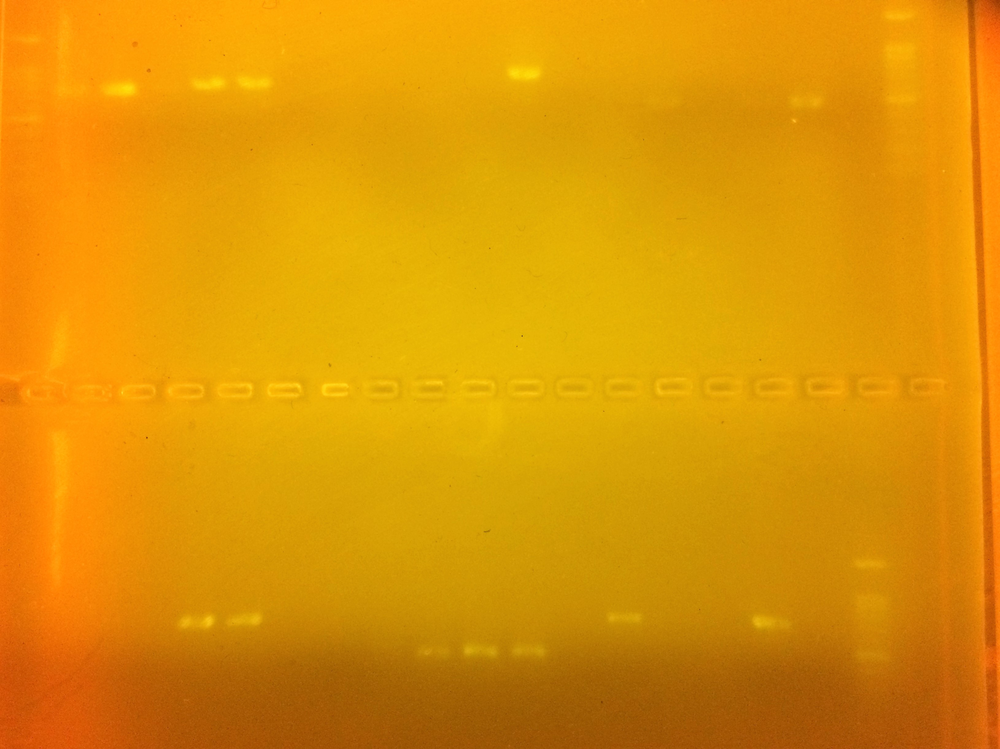

# Gel

As a reminder, here is the picture of the gel testing the success of the PCR amplification


# Download

A list of sequences is below. Let's start by looking for the link to `1Ipos_F_P1815443_064.ab1` and then download it to your working directory. Note the file code:

  * 1-4 is the group number
  * I tells us it's the ITS gene
  * F and R tell us whether the gene was sequenced with the Forward or Reverse primer

## ITS genes

```{r,eval=F,echo=F}
cat(paste("  * [",list.files("./Data/DNA_Barcoding/ITS"),"]","(./Data/DNA_Barcoding/",list.files("./Data/DNA_Barcoding/ITS"),")",sep=""),sep="\n")
```

  * [1I1_F_P1815443_047.ab1](./Data/DNA_Barcoding/1I1_F_P1815443_047.ab1)
  * [1I1_R_P1815443_094.ab1](./Data/DNA_Barcoding/1I1_R_P1815443_094.ab1)
  * [1I2_F_P1815443_048.ab1](./Data/DNA_Barcoding/1I2_F_P1815443_048.ab1)
  * [1I2_R_P1815443_011.ab1](./Data/DNA_Barcoding/1I2_R_P1815443_011.ab1)
  * [1I4_F_P1815443_063.ab1](./Data/DNA_Barcoding/1I4_F_P1815443_063.ab1)
  * [1I4_R_P1815443_012.ab1](./Data/DNA_Barcoding/1I4_R_P1815443_012.ab1)
  * [1Ineg_F_P1815443_079.ab1](./Data/DNA_Barcoding/1Ineg_F_P1815443_079.ab1)
  * [1Ineg_R_P1815443_028.ab1](./Data/DNA_Barcoding/1Ineg_R_P1815443_028.ab1)
  * [1Ipos_F_P1815443_064.ab1](./Data/DNA_Barcoding/1Ipos_F_P1815443_064.ab1)
  * [1Ipos_R_P1815443_027.ab1](./Data/DNA_Barcoding/1Ipos_R_P1815443_027.ab1)
  * [2I5_F_P1815443_095.ab1](./Data/DNA_Barcoding/2I5_F_P1815443_095.ab1)
  * [2I5_R_P1815443_044.ab1](./Data/DNA_Barcoding/2I5_R_P1815443_044.ab1)
  * [3Ipos_F_P1815443_096.ab1](./Data/DNA_Barcoding/3Ipos_F_P1815443_096.ab1)
  * [3Ipos_R_P1815443_059.ab1](./Data/DNA_Barcoding/3Ipos_R_P1815443_059.ab1)
  * [4I4_F_P1815443_029.ab1](./Data/DNA_Barcoding/4I4_F_P1815443_029.ab1)
  * [4I4_R_P1815443_076.ab1](./Data/DNA_Barcoding/4I4_R_P1815443_076.ab1)
  * [4I5_F_P1815443_030.ab1](./Data/DNA_Barcoding/4I5_F_P1815443_030.ab1)
  * [4I5_R_P1815443_091.ab1](./Data/DNA_Barcoding/4I5_R_P1815443_091.ab1)
  * [4I6_F_P1815443_045.ab1](./Data/DNA_Barcoding/4I6_F_P1815443_045.ab1)
  * [4I6_R_P1815443_092.ab1](./Data/DNA_Barcoding/4I6_R_P1815443_092.ab1)

## rbcL gene

```{r,eval=F,echo=F}
cat(paste("  * [",list.files("./Data/DNA_Barcoding/rbcL"),"]","(./Data/DNA_Barcoding/",list.files("./Data/DNA_Barcoding/rbcL"),")",sep=""),sep="\n")
```

  * [1r1_F_P1815443_015.ab1](./Data/DNA_Barcoding/1r1_F_P1815443_015.ab1)
  * [1r1_R_P1815443_062.ab1](./Data/DNA_Barcoding/1r1_R_P1815443_062.ab1)
  * [1r2_F_P1815443_016.ab1](./Data/DNA_Barcoding/1r2_F_P1815443_016.ab1)
  * [1r2_R_P1815443_077.ab1](./Data/DNA_Barcoding/1r2_R_P1815443_077.ab1)
  * [1r4_F_P1815443_031.ab1](./Data/DNA_Barcoding/1r4_F_P1815443_031.ab1)
  * [1r4_R_P1815443_078.ab1](./Data/DNA_Barcoding/1r4_R_P1815443_078.ab1)
  * [1r5_F_P1815443_032.ab1](./Data/DNA_Barcoding/1r5_F_P1815443_032.ab1)
  * [1r5_R_P1815443_093.ab1](./Data/DNA_Barcoding/1r5_R_P1815443_093.ab1)
  * [2r5_F_P1815443_080.ab1](./Data/DNA_Barcoding/2r5_F_P1815443_080.ab1)
  * [2r5_R_P1815443_043.ab1](./Data/DNA_Barcoding/2r5_R_P1815443_043.ab1)
  * [3r2_F_P1815443_013.ab1](./Data/DNA_Barcoding/3r2_F_P1815443_013.ab1)
  * [3r2_R_P1815443_060.ab1](./Data/DNA_Barcoding/3r2_R_P1815443_060.ab1)
  * [3rpos_F_P1815443_014.ab1](./Data/DNA_Barcoding/3rpos_F_P1815443_014.ab1)
  * [3rpos_R_P1815443_075.ab1](./Data/DNA_Barcoding/3rpos_R_P1815443_075.ab1)
  * [4r5_F_P1815443_046.ab1](./Data/DNA_Barcoding/4r5_F_P1815443_046.ab1)
  * [4r5_R_P1815443_009.ab1](./Data/DNA_Barcoding/4r5_R_P1815443_009.ab1)
  * [4r6_F_P1815443_061.ab1](./Data/DNA_Barcoding/4r6_F_P1815443_061.ab1)
  * [4r6_R_P1815443_010.ab1](./Data/DNA_Barcoding/4r6_R_P1815443_010.ab1)


# Quality Control

First, inspect the [sequencing statistics](./FieldMethods/Data/BarcodePlateStats.csv). What data do you think each of the columns are showing?

  * Well	
  * Chromatogram
  * Sample
  * DNA Type
  * Submission Lot	
  * Project	
  * Primer	
  * DNA Type - Template Size	
  * Comment	
  * Length	
  * Score	
  * Capilary	
  * Ok

Next, we will use an R package called `sangerseqR` inspect the chromatograph, sometimes called the 'trace' file. To make sense of the chromatograph you should __review how Sanger Sequencing works__.

The `sangerseqR` package is part of the __bioconductor__ package for R, which has a lot of great tools for analyzing 'omics' data. For more information, check out the [bioconductor website](https://www.bioconductor.org/).

There are a lot of packages, so we'll just install the sangerseqR package rather than trying to install everything in bioconductor.

```{r, eval=F}
source("https://bioconductor.org/biocLite.R")
biocLite(c("sangerseqR"))
```

Now load the library and read in the sequence for your sample:

```{r}
library(sangerseqR)
rbcL<-read.abif("./Data/DNA_Barcoding/ITS/1Ipos_F_P1815443_064.ab1")
```

We convert the ab1 file to a Sangerseq object using the `sangerseq()` function and inspect the structure of the data file

```{r}
rbcLseq <- sangerseq(rbcL)
str(rbcLseq)
```

This is an example of a 'class object'. You can see the `@` to denote different elements of the object. This is similar to the way that `$` denotes a column in a data.frame object. These are called 'slots' and can be used to subset the class object the same way `$` can subset the data.fram object. 

```{r}
rbcLseq@primarySeqID
rbcLseq@primarySeq
```

Here is an overview of the main slot elements:

  * __primarySeqID__ -- Identification of the primary sequence
  * __primarySeq__ -- The most likely sequence based on the florescence pattern
  * __secondarySeqID__ -- Secondary sequence ID. Secondary calls may not be present, but can occur when there is a signal for more than one base pair 
  * __secondarySeq__ -- The secondary sequence
  * __traceMatrix__ -- A matrix containing the normalized signals for A,C,G,T.
  * __peakPosMatrix__ -- A matrix containing the position of the maximum peak values for each base.
  * __peakAmpMatrix__ A matrix containing the maximum peak amplitudes for each base. 

Now we can graph the trace.

```{r}
chromatogram(rbcLseq, width = 200, height = 2, showcalls = "both")
```

You can use the `trim5` and `trim3` parameters to trim the unsequenced base pairs. We can use it with the `width` parameter to 1 ' or to 'zoom in'. We can alsoLet's look at the early part of the sequence:

```{r}
chromatogram(rbcLseq, width = 50, height = 2, trim3=1100, showcalls = "both")
```

What do you notice about the early part of the sequence?

Play around with the parameters until you have a good sequence. You may want to use the `filename=graph.pdf` parameter to save the graph to a pdf file that makes it easier to zoom in and inspect the graph.

A quick and easy method is to use the `MakeBaseCalls()` functions to 'call' the base pairs based on the strongest signals.

```{r}
makeBaseCalls(rbcLseq)
```

# BLAST

BLAST stand for Basic Local Alignment Search Tool, and there is a nice web interface for it at the address [https://blast.ncbi.nlm.nih.gov/Blast.cgi](https://blast.ncbi.nlm.nih.gov/Blast.cgi)

Take a moment to __note the different types of BLAST__. Why do you think there are so many different types?

We are using genes with fairly low mutation rates, so BLASTn is appropriate for finding a species-level match.


Simply copy and paste the sequence above into the sequence search box and you are ready to go!


