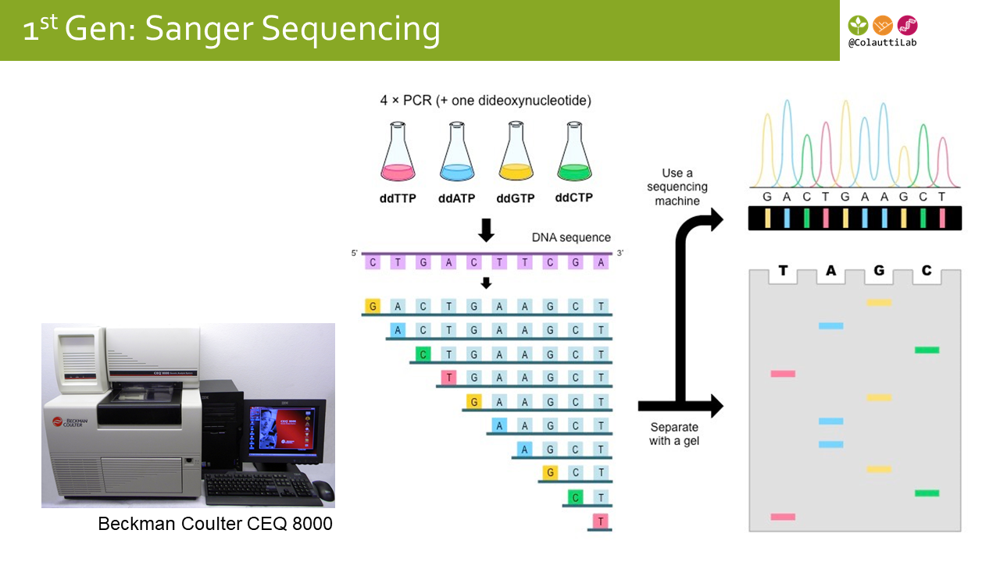
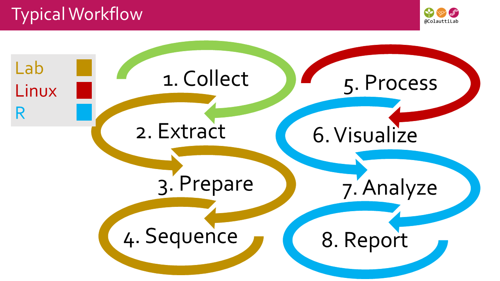
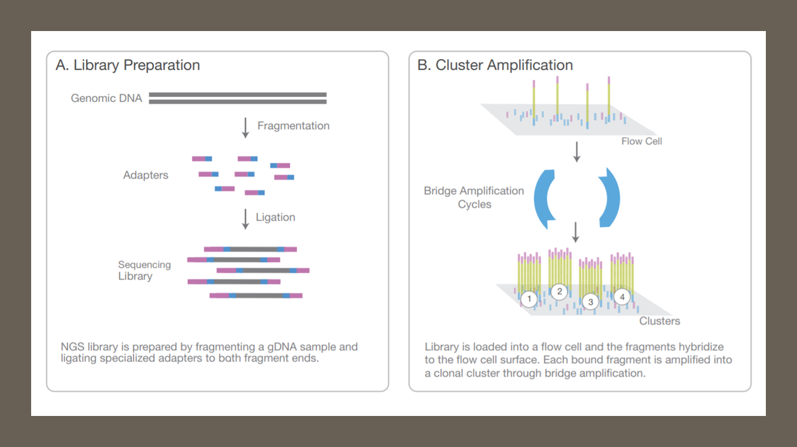
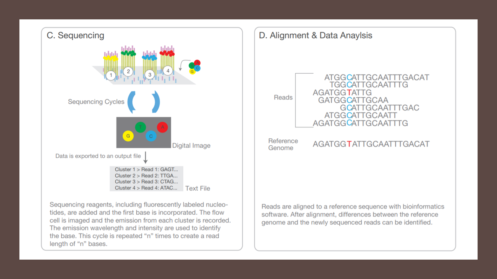

# Learning Goals

1. Compare major sequencing platforms and approaches
2. Examine major data formats for DNA sequencing
3. Analyze sequence data from the command line

# Introduction

  * Colautti Lab research overview
  
# __FIRST__ Generation Sequencing

> a.k.a. Sanger Sequencing

  * Sanger overview
  * DNA Barcodes (e.g. Barcode of Life Database [BoLD](http://v3.boldsystems.org))
  * Quick overview of extraction & PCR [protocol](FieldMethods/Protocols/PCR_Protocol.pdf)
  * DNA barcodes [tutorial](FieldMethods/DNAbarcodes.html)

Classic sequencing uses the Sanger method [(Wikipedia)](https://en.wikipedia.org/wiki/Sanger_sequencing).

__Step 1.__ Extract and Purify DNA

__Step 2.__ Select single target (e.g. PCR)

__Step 3.__ Dye-terminator PCR

__Step 4.__ Visualize on a gel



## Key points

  * Sanger sequencing is the 'classic' sequencing method
  * Gel can read only one target sequence at a time
  * DNA barcodes can be used to identify species
  * R can be a powerful interface for visualizing & analyzing sequencing data

# __SECOND__ Generation

  * Overview of sequencing methods
  * Overview of de novo assembly
  * _de novo_ assembly [tutorial](NGS/deNovoTutorial.html)
  * Overview of transcriptome analysis
  * Differential expression [tutorial](NGS/DifferentialExpression.html)
  * Metagenomics overview

## Typical Workflow



## Illumina Sequencing Overview





## Key points

  * There are several flavours of 'next generation' sequencing (NGS)
  * NGS platforms sequence many fragments simultaneously, unlike the Sanger method
  * Sequencing technology is evolving faster than Moore's Law of computation
  * Dealing with billions to trillions of base pairs of data is not trivial
  * Bioinformatics is usually the bottleneck and main cost of a project involving NGS

# __THIRD__ Generation

[Nanopore MinION metagenomics](./FieldMethods/DiscussionPapers/FieldMethodsNanopore_WIMP.pdf)

* [Output example #1](https://epi2me.nanoporetech.com/workflow/report_index/1582?token=C13185B8-3F0F-11E8-B528-07C0492C26E4;id_workflow_instance=164831&chain_component=2&rand=0.461169645637845#!/classificationWimp)
* [Output example #2](https://epi2me.nanoporetech.com/workflow/report_index/1569?token=07C73B18-4239-11E8-8CD3-08F2492C26E4;id_workflow_instance=165108&chain_component=2&rand=0.49242963976009#!/classificationWimp)

[What's in My Pot?](./FieldMethods/DiscussionPapers/Nanopore_WIMP2015.pdf)

  * Inspect the data on the [One Codex website](https://app.onecodex.com/projects/bb_minion_env)
  * Can be run in 'real time' (i.e. BLAST results as they are sequenced)

# Sequencing Comparison Table

```{r,echo=F,warning=F,message=F}
options(scipen=3)
options(digits=2)
library(knitr)
library(kableExtra)
SeqCmp<-read.csv("./FieldMethods/Sequencing_Throughput_Comparison.csv",header=T)
#SeqCmp$Gbp<-signif(SeqCmp$Gbp,3)
kable(SeqCmp) %>%
  kable_styling(bootstrap_options = c("striped", "hover", "condensed", "responsive"),full_width=F)
```


# Other links of interest:

## Introduction to R

  1. [R Fundamentals](.RCrashCourse/1_fundamentals.html)
      + Fallopia community ecology experiment [Data](./FieldMethods/Data/FallopiaData.csv)
      + Test your [R knowledge](./RCrashCourse/1_fundamentals_test.html)
  2. [Basic visualizations with `qplot()`](./RCrashCourse/2_qplot.html)
  3. [R Markdown](./RCrashCourse/5_advanced.html#2_r_markdown) 
      + [LaTeX cheat sheet](./latexsheet.pdf) for rendering equations in R Markdown
      + see also:
          + Very handy .Rmd [cheat sheet](http://www.rstudio.com/wp-content/uploads/2016/03/rmarkdown-cheatsheet-2.0.pdf)
          + Detailed .Rmd [website](http://rmarkdown.rstudio.com/lesson-1.html)
          + [R Notebooks](http://rmarkdown.rstudio.com/r_notebooks.html#overview)
  4. [Advanced visualizations with `ggplot()`](./RCrashCourse/3_ggplot.html)
  5. [Regular expressions](./RCrashCourse/4_regex.html)
      + Regex [cheat sheet for R](https://www.rstudio.com/wp-content/uploads/2016/09/RegExCheatsheet.pdf)
      + General regex [cheat sheet](https://www.cheatography.com/davechild/cheat-sheets/regular-expressions/pdf/)

## Introduction to Python

  1. [Python Fundamentals](./PythonCrashCourse/1_Fundamentals.html)
  2. Analysis [pipelines with python & snakemake](https://hpc-carpentry.github.io/hpc-python/)

## Linux/Command Line

  1. [Introduction to high-performance computing](https://hpc-carpentry.github.io/hpc-intro/)
      + Unix [cheat sheet 1](https://files.fosswire.com/2007/08/fwunixref.pdf)
      + Unix [cheat sheet 2](http://cheatsheetworld.com/programming/unix-linux-cheat-sheet/)
  2. Version Control with [Git & GitHub](http://swcarpentry.github.io/git-novice/)

## Guides to Reproducible Science

From the British Ecological Society

  1. [Data Management](./Readings/BES-Data-Guide-2017)
  2. [Reproducible Code](./Readings/BES-Reproducible-Code.pdf)
  3. [Getting Published](./Readings/BES-Getting-Published-Guide-2017.pdf)
  4. [Peer Review](./Readings/BES-Peer-Review-Guide-2017.pdf)

