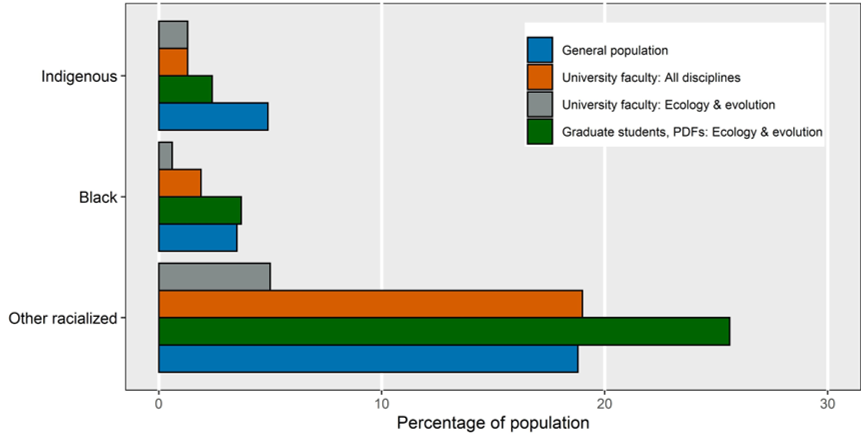

> "The data show very clearly, that we have been hiring for research excellence, but also for identity. It's just that the identity was white men."

*Dr. Maydianne Andrade [(research website)](https://www.utsc.utoronto.ca/labs/andrade/), interviewed on [Quirks & Quarks, 27-Jan-2023](https://www.cbc.ca/radio/quirks/dec-12-spotting-steve-superbolts-and-megaflashes-hyperventilating-sober-and-more-1.5835976/maydianne-andrade-on-black-widow-spiders-and-fighting-for-racial-equity-in-science-1.5835987#:~:text=Andrade%2C%20an%20ecologist%20with%20the%20University%20of%20Toronto,extremism%2C%20in%20a%20funny%20kind%20of%20spidery%20way.)*

# Indigenization 

Canadians have a global reputation for being friendly and inviting, and standing up for peace and justice around the world. However, we share a dark and disturbing history defined by European colonialism, which we are only starting to address. As I write this reports are emerging of another unmarked grave site at a former residential school, this one in Brantford, Ontario, just 350 km from Kingston. 

In 2021, the Canadian Government published a report of the [Truth and Reconciliation Commission](https://rcaanc-cirnac.gc.ca/eng/1450124405592/1529106060525), which provides a thorough accounting of this dark history and proposes a number of positive steps for the future. 

At Queen's University, we have excellent training resources on decolonization and indigenization [Indigenous Community Research Partnerships](https://www.queensu.ca/equity/public/icrp0/). You can sign in with your student number or staff ID to access these modules.

Land acknowledgements are a small step that we can make as descendants of colonists, to start to come to terms with our dark history. A land acknowledgement should be a personal reflection on our shared history. If you aren't familiar with the diversity of Indigenous Peoples in North America, this map of [Territories by Land](https://www.whose.land/en) is a nice visualization.

Land acknowledgments should not be seen as empty platitudes, but rather an opportunity to learn more about our shared history. For me personally, it has been an opportunity to think deeply about our relationship with nature and what it means to live a meaningful life. In researching the Anishinabee, I came across the [Teachings of the Seven Grandfathers](https://nhbp-nsn.gov/seven-grandfather-teachings/), which provide an excellent roadmap for this journey.

## Land Acknowledgement

The Colautti Lab at Queen's University is situated on traditional [Anishinaabe](https://www.thecanadianencyclopedia.ca/en/article/anishinaabe) (Ah- nish-in-ah-bay) and [Haudenosaunee (Iroquois)](https://www.thecanadianencyclopedia.ca/en/article/iroquois) (Ho-den-o-show-nee) territory. We are grateful to be able to live, learn and play on these lands.

By acknowledging our shared history, we recognize a long and storied past that began long before the earliest European colonies. We also acknowledge this territory’s significance for the Indigenous Peoples who lived, and continue to live, upon it and whose practices and spiritualities were tied to the land and continue to develop in relationship to the territory and its other inhabitants today.

It is my understanding that this territory is included in the Dish With One Spoon Wampum Belt Covenant, an agreement between the Iroquois Confederacy and the Confederacy of the Ojibwe and Allied Nations to peaceably share and care for the resources around the Great Lakes. The Kingston Indigenous community continues to reflect the area’s Anishinaabek and Haudenosaunee roots. There is also a significant [Métis](https://www.thecanadianencyclopedia.ca/en/article/metis) community as well as First Peoples from other Nations across Turtle Island present here today.

# Under-representation

Part of our philosophy is that research benefits from diverse perspectives and different ways of thinking. Under-representation in EEB and the Biological Sciences represents failure to achieve research excellence.

Stats from the [Canadian Association of University Teachers](https://www.caut.ca/sites/default/files/caut_equity_report_2018-04final.pdf)

|Equity Group | Labour force | Professors|
|--------------|---------------|-----------------------|
| Aboriginal | 3.8% | 1.4% |
| Black | 3.1% | 2% |
| Women | 50% | 44% (27% Full Prof.)

](NIH_Gap.jpg)

However, this varies across disciplines and instutions. In the Biological Sciences at Canadian universities, representation tends to be much lower. Here's a figure showing the race gap in a number of disciplines. Note the location of Evolutionary Biology:

](SA_RaceGap.png)

You might think Canada is doing much better than the United States and Europe, because we like to perceive ourselves as more progressive. Nope:

# What is EDI?

+ **Equity** Not to be confused with 'equality', equity requires the removal of barriers that prevent equal opportunity. Rather than 'treat everyone equally' we have to realize that many people face **sytemic barriers** that we have never faced. These barriers are discussed below.

+ **Diversity** In EEB we are all familiar with the concept of diversity. In the context of EDI it particularly includes groups who are historically marginalized based on skin colour, place of origin, religion, (dis)ability, sex, sexual orientation, gender identity/expression and age.

+ **Inclusion** This is the principal of including, respecting, and valuing the contributions of all. This includes amplifying some voice

# Systemic Barriers

Systemic barriers include any practices or policies that result in uneven access. As a starting point, here are some barriers from previous lab meetings and potential solutions. Can you think of more?

1. **Lack of Mentors** -- Our mentorship is shaped by our own experience in academia and these can leave us blind to the different challenges faced by mentees with different journeys. Even things that seem as innocuous as 'going out for beer' can be a barrier to people who don't drink for religious or other personal reasons. 

2. **Microagressions** -- Incidents that seem minor on their own but have strong effects in aggregate. For more information, see [this 2023 presentation](./Files/Microaggression_workshop_2023_MJGQ.pdf) from PhD Student María José Gómez Quijano.  

# Anti-racism

> "The beauty of anti-racism is that you don’t have to pretend to be free of racism to be anti-racist. Anti-racism is the commitment to fight racism wherever you find it, including in yourself. And it’s the only way forward." -- Ijeoma Oluo

# To Do: 

Read/summarize Government of Canada pilot program called [Dimensions](http://www.nserc-crsng.gc.ca/NSERC-CRSNG/EDI-EDI/Dimensions_Dimensions_eng.asp); see also this [Press Release](http://www.nserc-crsng.gc.ca/Media-Media/NewsRelease-CommuniqueDePresse_eng.asp?ID=1062) to increase EDI at Canadian Universities

Read/summarize [Reducing bias in the evaluation of researchers](https://elifesciences.org/inside-elife/1fd1018c/research-assessment-reducing-bias-in-the-evaluation-of-researchers)

[MSU Research Toolkit](http://www.montana.edu/nsfadvance/documents/MSU_searchtoolkit_v5.0web.pdf)
[UNC Charlotte Resources for Search Committees](https://advance.uncc.edu/programming/programs/faculty-recruitment/resources-search-committees-including-evaluation-rubrics)

