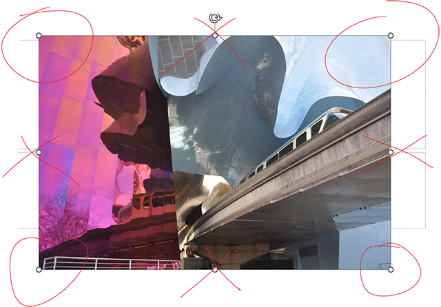
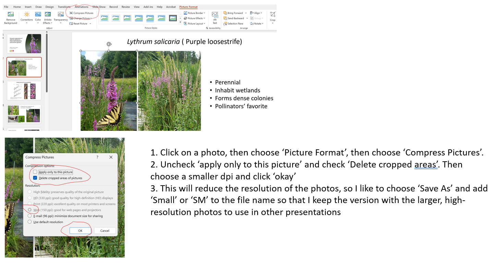

# Presentations

Unless you are a seasoned scientist with published papers in peer-reviewed manuscripts, your oral presentations and posters are the only way for the scientific community to learn about your hard work. These play important roles in communicating our research methods and findings to each other, and to the public. Effective presentations come in many different formulations, but generally you want to *communicate* something to an *audience*. It's important to always think about your audience -- what do they already know, and what do they need to know? Then, think about what you want to try to communicate to them. 

Below is a checklist for professional and effective presentations. Be sure to follow these carefully. The checklist is designed to be a short reference to ensure that your presentations meet the minimum requirements for a professional poster at an international conference. Some of these concepts might be new to you, in which case more detail is provided after the checklist.

# Before you begin

* [ ] **Make a timeline**. Write down the dates of the conference, and the early bird registration deadline. Make a list of what you want to include in your poster, and set some deadlines for yourself so that you can have a first draft at least 2 weeks before the registration and a final draft of your poster at least 4 weeks before the conference. If you are planning to conduct new analyses and make new figures, be sure to give yourself enough time to make the figures AND triple-check for errors.
* [ ] **Make an outline**. Turn off your computer and take a piece of paper (or several). Sketch out the poster or slides. What should go in each section? How much presentation time or poster space will you devote to the introduction/overview, methods, results, and discussion/impact?
* [ ] **Get feedback**. Ask your peer or your advisor 

# General checklist

  * [ ] Identify your audience. What level of expertise and experience do they have?
  * [ ] Identify your key result(s). Print or draw them out by hand. What are you trying to communicate? Try to write the take-home message using a single word or short phrase.
  * [ ] Use [Biorender](https://www.biorender.com/) to make clear, professional diagrams (e.g., analysis pipeline or experimental design). Share the final version with Rob, and he can send you a high-resolution version for your presentation.
  * [ ] Choose a concise and descriptive title. Puns and humour are okay, as long as they aren't at the expense of accuracy and clarity.
  * [ ] Ensure main text is a minimum 24pt (18 pt okay for references only).
  * [ ] Ensure figures can be interpreted by people who are colour-blind. A simple way to do this is to convert your figures to 'greyscale' and make sure the different shades are clear.
  * [ ] Use clean and simple graphs with large text and minimal clutter. When creating figures with `ggplot` in R, you can include these two lines of code at the top of your R script or R Markdown file to produce clean 'publication-ready' graphs:

```{r, eval=F}
source("http://bit.ly/theme_pub")
theme_set(theme_pub())
```


# Oral presentation checklist

Ensure that your slides address all of the following points:

* [ ] Use a clean and simple slide design (DO NOT use Powerpoint templates -- these add clutter). For Powerpoint, consider using this [Colautti Lab Powerpoint Template](../Files/ColauttiLab_SlideFormat.pptx), which includes pre-formatted slides and unified colour scheme. Using this template shows that your talk has a quality 'seal of approval' from the lab.
* [ ] For more presentation tips, see this [Presentation Guide](../Files/Presentation_PAW_Walkthrough.pdf) from Chloe Schmidt, a former graduate student of Colin Garroway (U Manitoba)
* [ ] A title slide with your name, co-authors, and affiliation
* [ ] 1-3 Introduction slides including the 'big picture' context, unanswered question(s), and specific background that the audience needs to understand your results. 
* [ ] Hypotheses and predictions are clearly laid out (If hypothesis X is true, then I expect to see Y)
* [ ] 2-5 Slides with methods and results
* [ ] 1-2 Slides emphasizing implications and impact of research
* [ ] Final Acknowledgments slide with funder information and key collaborators/assistants

(NOTE: Slide numbers above are for ~12 minute presentations) 

* [ ] ~1 slide per minute of presentation.
* [ ] Each slide has a short and concise title that captures the 'take-home message' and 32-36pt font.
* [ ] Slide titles have a consistent case. You can use regular sentence case. Or You Can Use Title Case (First Letter is Capital Except for Words Like 'the', 'an', 'and'). Use either but be consistent!
* [ ] All words are necessary. Often long sentences or slides with many points can be better represented with images, flow charts, or separate slides. Avoid overcrowding your poster or slides. Use keywords and short phrases, rather than long sentences. You generally don't need to write down phrases or sentences that you are going to say anyway.
* [ ] If your talk reports on results of an experiment, be sure to include a slide with images of the experimental design and include numbers to give a sense of the scale and amount of work involved.
* [ ] Check that each slide is *necessary*. A common mistake for inexperienced students is telling the audience everything you learned about a project or topic. Instead, focus on your core message. Usually, your core message will be something you discovered, or a new idea you are proposing. 
* [ ] Ensure that animations and transitions are used sparingly.
* [ ] Anticipate what questions you may get. You can include 'bonus slides' after your Acknowledgements slide to help address these questions, without increasing the length of your presentation.
  
# Poster presentation checklist

* [ ] Prepare an 'elevator pitch' to communicate your core message to your audience, as efficiently as possible (30 seconds max).
* [ ] Choose a program or website to make your poster (e.g., Powerpoint, Canva)
* [ ] Check the size requirements for your poster. The most common size is 4' by 3' (120 cm x 90 cm). Decide whether your poster will have the 'wide' or 'long' layout.
* [ ] Work through this [Presentation Guide](../Files/Presentation_PAW_Walkthrough.pdf), also from Chloe Schmidt, a former graduate student of Colin Garroway (U Manitoba)
* [ ] Ensure the palette is set to CMYK mode, not RGB. If your program doesn't do this, try 'Print to PDF' to check the colour scheme.
* [ ] Create a new document with the proper size. 
* [ ] Ensure that none of your images are 'pixelated' or 'squashed'. Never expand the size of your image -- this will make it blurry/pixelated. If you shrink the image, be sure to shrink both the x- and y- axis by the same ratio, otherwise the image will look squashed. In Powerpoint, use the corners to shrink an image, never the sides:

* [ ] Make sure your file size is optimized.
* [ ] Practice your 'elevator pitch'.

# Narratives

Your presentation should 'tell a story'. This is your core message or narrative. For experimental studies, there narrative will often follow the hypothesis-prediction-result narrative. That is, you define a hypothesis, use it to generate one or more predictions, show the data, and then return to the prediction(s) to reach a conclusion. From here, you can work backwards to figure out what your audience needs to know to understand the hypothesis, prediction, and results, and why it matters. Again, you should always keep your audience in mind. Here are a few questions to consider when deciding on your narrative.

* *What is their knowledge base*? This will help you decide how much background to include, and how much time you have to spend explaining your experimental design and results
* *What do they value*? Biologists are interested in the natural world, medical researchers want to know about human health, administrators care about policy, computer scientist are motivated by algorithms, lab technicians are interested in new techniques.


# Graphic design

Graphical elements and concepts are the basis slide or poster design. Here are a few basics:

1. **Lines** -- this includes text
2. **Shapes** -- any 2-dimensional shape
3. **Forms** -- modify 2-d shapes use shading and perspective to imply 3-dimensional shapes
4. **Texture** -- adds feel to shapes and forms
5. **Balance** -- describes how objects are laid out
6. **Rule of thirds** -- create a 3x3 grid on the page and have major elements fall along these lines rather than smack in the middle of the page or some other random place.

Watch this short (~5 min) [Youtube video on design fundamentals](https://www.youtube.com/watch?v=YqQx75OPRa0)

Graphic design is the unsung hero of visual presentation, both in slides and posters. There are entire degrees devoted to this stuff, but a few simple rules can take you a long way. These fall into a few general categories:

1. **Colour Theory**
2. **Layout and Composition**
3. **Typogaphy**
4. **Images**

## Colour theory

How to choose colours for your slides or poster?

1. Start with a theme -- e.g. colour of your study organism or major photos
2. Use the colour wheel to choose a colour scheme:
    1. **Monochromatic**
    2. **Analogous**
    3. **Complementary**
    4. **Split complementary**
    5. **Triadic**
3. Modify Hue, Saturation and Value

Or use a website to help you define a palette:

* [Adobe's colour wheel tool](https://color.adobe.com/create/color-wheel/)
* [coolors.co](https://coolors.co/)
* [colormind.io](http://colormind.io/)
* [paletton.com](http://paletton.com/#uid=1000u0kllllaFw0g0qFqFg0w0aF)

Watch the [Youtube Video on Colour Theory](https://www.youtube.com/watch?annotation_id=annotation_3938340727&feature=iv&src_vid=a5KYlHNKQB8&v=_2LLXnUdUIc)

## Layout and composition

There are 5 basic principles of good composition:

1. **Proximity** -- group similar/related elements together and different/unrelated elements apart
2. **Negative space** -- think of empty space as important as text or images. Use space to separate and define sections. If you don't have empty space then your composition will look cluttered.
3. **Alignment** -- use a grid system and take the extra time to align graphics and text to the grid. Misaligned elements look sloppy.
4. **Contrast** -- Use different colours, sizes, text styles, to emphasize elements and direct the reader.
5. **Repetition** -- Choose a limited number of elements and use them consistently (e.g. repeat the same colour for all section headers rather than different colours for each).

These are explained in more detail in this short (5 min) introductory [YouTube Video on Composition and Layout](https://www.youtube.com/watch?v=a5KYlHNKQB8)

## Typography

Choice of text is as important as any other element of your slide or poster presentation. There are three main text types, but in most cases you want to stick with a **sans serif** font throughout your presentation or poster.

1. **Serif** -- (e.g. Times New Roman) These fonts have embellishments  that look nice but
2. **Sans Serif** -- (e.g. Arial) These fonts are simpler but easier to read at a distance.
3. **Display fonts** -- (e.g. ALL CAPS, comic sans) These fonts should be used sparingly.

It's usually best to use 1 font type, and then use bold, italic and size to create variants for different headers and body text.

Typography has several design elements that are analogous to the considerations for general layout and composition, as outlined above. 

1. **Hierarchy** -- Use hierarchy of text (e.g. header, subheader, reference)
2. **Leading** -- Line spacing
3. **Tracking** -- Letter spacing
4. **Kerning** -- space between individual letters

See the [Youtube Video on Typography](https://www.youtube.com/watch?v=sByzHoiYFX0)

## Images

Images are absolutely crucial to any good presentation or poster. Take lots of pictures while working on your project and organize them so that you can quickly find them when putting together slides or a poster.

Understand the difference between *vector* and *raster* graphics. Search online or look at the first few slides of this lecture from BIOL 812: [Visualizations: Examples and key concepts](../Lectures/Graphical_Concepts.pdf)

Be sure to use high-quality, high-resolution photos for posters -- you need to zoom way in to see if your image will look pixelated when printed. Don't distort images by expanding along the x- or y-axis without adjusting the other axis by the same proportion.

With very few exceptions, you should use vector images for most graphs. Some exceptions can be made if your graph contains a raster image (e.g. map) or if you have too many data points (>>100,000). You can use the svg() function in R to output to an open-source vector format with the .svg extension.

See the [Youtube Video on Images](https://www.youtube.com/watch?v=MELKuexR3sQ)

# Conference Preparation

You have a killer presentation prepared, now what?

## Check file size

First, check the file size. If you are using a lot of high-quality photos you may find that your file size is dozens to hundreds of megabytes. Here's a tip to create a smaller version for presentations (be sure to save it as a new file):



## Make backups of backups

Next, what happens if you you email your presentation and the organizers lose it, or the file gets corrupted? Answer, prepare multiple backups. From Powerpoint you can 'Save As' a PDF file for backup. Then, save both your Powerpoint and PDF files to an external thumb drive and bring it with you. Finally, save it somewhere that you can access online, like DropBox, Google Drive, or OneDrive.

## Practice, practice, practice

Practice your talk as much as possible. You don't need to memorize a script, but record yourself and then watch it. Wherever you are using a lot of 'ums' or 'aws' or slowing down too much, that is a good indication that you need to think of a short and succinct way to explain something. Choose your words carefully! Inaccuracies and ambiguities give the impression that you haven't been careful analyzing and interpreting your data.

# Other Tips

Read the tips and guidelines for presentations from the [TED Blog](http://blog.ted.com/10-tips-for-better-slide-decks/?utm_campaign=social&utm_medium=referral&utm_source=facebook.com&utm_content=ted-blog&utm_term=business).

See also: [Powerpoint Graphics Tips](https://www.slideshare.net/PlantTeaching/images-for-impact?ref=https://www.botany.one/2016/08/a-picture-is-worth-a-thousand-bullet-points/)

Check out this very different and innovative idea about poster design in this [Youtube Video](https://www.youtube.com/watch?v=1RwJbhkCA58). 


# Tools

These tools are listed in [Rougier et al. (2014)](https://journals.plos.org/ploscompbiol/article?id=10.1371/journal.pcbi.1003833)

**Matplotlib** is a python plotting library, primarily for 2-D plotting, but with some 3-D support, which produces publication-quality figures in a variety of hardcopy formats and interactive environments across platforms. It comes with a huge gallery of examples that cover virtually all scientific domains (http://matplotlib.org/gallery.html).

**Inkscape** is a professional vector graphics editor. It allows you to design complex figures and can be used, for example, to improve a script-generated figure or to read a PDF file in order to extract figures and transform them any way you like.

**TikZ** and **PGF** are TeX packages for creating graphics programmatically. TikZ is built on top of PGF and allows you to create sophisticated graphics in a rather intuitive and easy manner, as shown by the Tikz gallery (http://www.texample.net/tikz/examples/all/).

**GIMP** is the GNU Image Manipulation Program. It is an application for such tasks as photo retouching, image composition, and image authoring. If you need to quickly retouch an image or add some legends or labels, GIMP is the perfect tool.

**ImageMagick** is a software suite to create, edit, compose, or convert bitmap images from the command line. It can be used to quickly convert an image into another format, and the huge script gallery (http://www.fmwconcepts.com/imagemagick/index.php) by Fred Weinhaus will provide virtually any effect you might want to achieve.

**D3.js** (or just D3 for Data-Driven Documents) is a JavaScript library that offers an easy way to create and control interactive data-based graphical forms which run in web browsers, as shown in the gallery at http://github.com/mbostock/d3/wiki/Gallery.

**Cytoscape** is a software platform for visualizing complex networks and integrating these with any type of attribute data. If your data or results are very complex, cytoscape may help you alleviate this complexity.

**Circos** was originally designed for visualizing genomic data but can create figures from data in any field. Circos is useful if you have data that describes relationships or multilayered annotations of one or more scales.
