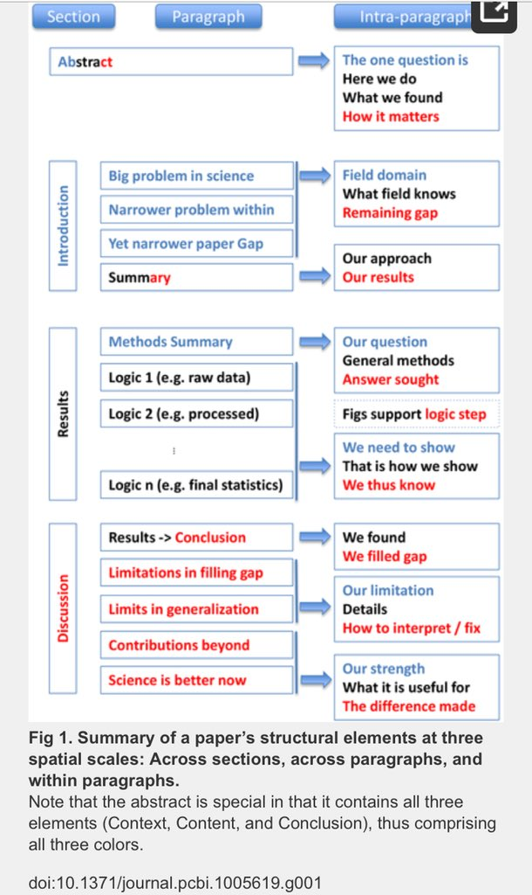
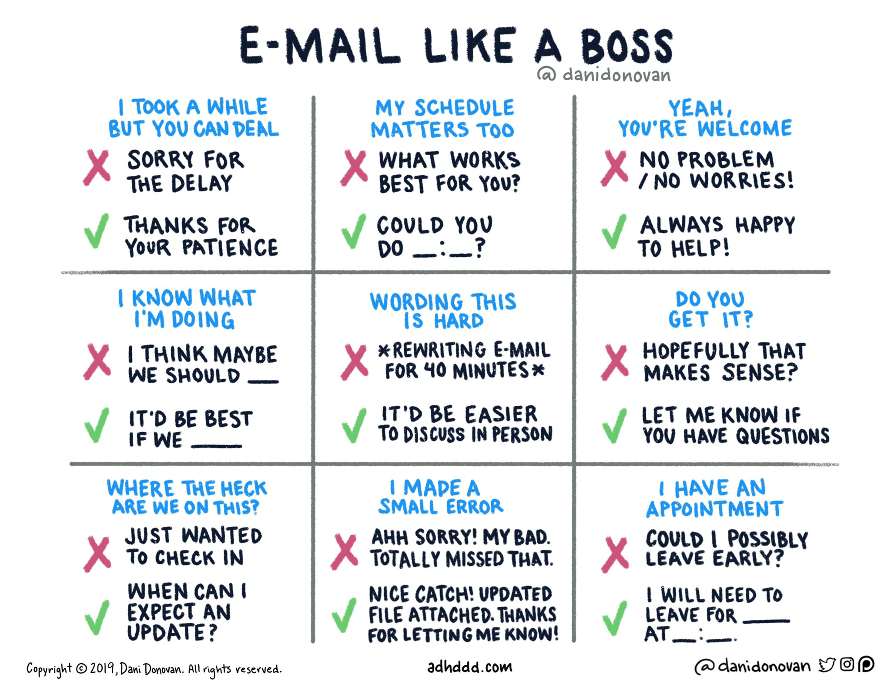

> "I never thought the write-up could be as challenging as it has been."      --- email from a 537 BSc Hs Thesis student. March 28, 2016

This document outlines most of the 'what' to do. You should also carefully read more about 'how' to write. In addition to reading the suggestions in this page, you should read these additional links:

Read this explanation in the 2016 Bulletin of the Ecological Society of America: [Scientific Writing Made Easy](./References/Turbek2016Writing.pdf)

And this [guide](./References/BES_WritingTips.pdf) from the British Ecological Society

See this thread of great academic [writing tips on twitter](https://twitter.com/saraannhart/status/1126222700895195136?s=03). And this [short note](https://www.nature.com/articles/d41586-019-02918-5) of points for writing in high-impact journals like Nature.

If you are a graduate student, consider getting a copy of Stephen Heard's book [The Scientist's Guide to Writing](https://www.amazon.ca/Scientists-Guide-Writing-Effectively-throughout/dp/0691170223/ref=sr_1_1?ie=UTF8&qid=1523074693&sr=8-1&keywords=scientists+guide+to+writing+heard). Read it carefully and refer back to it periodically.

Read the [Notes on Academic Writing](https://ecogeno.wordpress.com/2017/10/20/academic-writing/) from a discussion group led by Chris Eckert.

Read the [Research Proposal Tips](https://ecogeno.wordpress.com/2016/10/04/research-proposal-tips/) on the lab blog, if you are writing a research proposal.


__Important note:__ The stages listed below are not  independent. You will likely keep reading throughout the process and modify your questions/hypotheses and writing as you read and develop your ideas.

# 1. Make a timeline

Work backwards from your final deadline. Assume a turnaround time of about 1-2 weeks for short documents (<2,500 words or <10 double-spaced pages, double-spaced), and 2-4 weeks for larger documents. Look at the steps for writing below and then work from the bottom up to determine your timeline.

# 2. Identify Main Questions/Hypotheses
This is the most crucial step and you should work this out with your supervisor as soon as possible. Initially you may only have a vague idea of your topic and what your questions might be. They are not set in stone, but still try to make them as concrete and tractable as you can. Keep them in mind as you move on to step 2.

# 3. Read, Read, Read! 

Yes, the first step of writing is to __READ__. Read early and read often. See the [Reading page](Reading.html) for tips. Needless to say: read, read read!

# 4. Synthesize

Take careful notes as you read. Make concept maps, visual models, mathematical models, find commonalities, identify unanswered questions, and look for contradictory findings. Look carefully at the methods and results and think about alternative explanations to what is presented in the discussion. 

First, accept that __you will never write a perfect paper__, and that's okay. You will constantly need to review and revise your work at every stage. Don't let yourself get frustrated. Nothing worth doing is easy. Embrace the struggle!

# 5. pre-Draft

Think of your final thesis as a potential publication in a peer-reviewed journal. It should be the end result of your absolute best effort. You will then get valuable feedback from your committee, which you can incorporate to improve your thesis before submitting it for peer review.

To write a strong thesis, start with IDEAS, not words

## Outline Stage 1

You must PLAN CAREFULLY. Long before you write even a single sentence.

Think about the STRUCTURE of a good scientific paper, right from the beginning. Make your outline with this structure in mind:



  * If you have data. Start by making your 'final' figures and tables. In other words, format them and write captions just as they would appear in your final document.
  * Start with some brainstorming notes. Why would somebody be interested in this study? What does it contribute to scientific knowledge? How does it fit into the broader context?
  * Make a concept map or outline of your key points. Each one should relate to your key results in some way.
  * Boil everything down to 1 to 3 points that you want the reader to take away from your study. What are the biggest innovations/findings of your work? Or in the case of a proposal, what are the biggest questions you will address?
    
## Outline Stage 2

  * Organize your thoughts from Stage 1 into a coherent flow. 
  * USING POINT-FORM Start with the main sections:
      + **Introduction** -- Set up your research for the reader. Provide background information and motivate/justify why you spent (or will spend) so much time on this project.
      + **Methods** (or proposed methods) -- Summarize your experimental design and analysis so that the reader can follow what you did. More detailed methods, including R code, pictures, and experimental designs should usually be included as supplementary material (using R markdown). 
      + **Results** (or expected/potential results) -- Hold the reader's hand and walk them through your findings. Anticipate what questions they might have and point out what results or analyses might address their questions.
      + **Discussion** -- Summarize the key findings again, then relate it to previous work. Avoid wild speculation, but cautiously walk the reader through what you think the results mean for answering the main questions you posed in the introduction.

THIS is the first thing you should show me. DON'T WAIT until you have a first draft! I want to see this and comment on it before you start writing your fist draft.

## Outline Stage 3

Once you have finished Stage 2, you should be able to get to Stage 3 pretty quickly

  * Take your sections from Stage 2 and Lay out each paragraph, again in point form
  * For each paragraph, determine what is the topic sentence and the main points of each sentence. What is the conclusion/transition to the next paragraph. It can be helpful to include key references (no formal reference list, just a reminder of what references will go where)

# 6. First Draft

ONLY AFTER you have completed stages 1-3 should you start writing. Despite laying everything out in great detail, this step is going to take a longer than you think! 

  * Spend time carefully crafting each sentence to be as clear as possible.
  * Edit sentences to be more concise. See examples online (e.g. [Purdue OWL](https://owl.english.purdue.edu/owl/resource/572/01/))
  * Don't make your reader work harder than they have to
  * Make sure your methods are complete. A competent scientist reading your methods should be able to [reproduce your experiment](https://www.youtube.com/watch?v=Ct-lOOUqmyY).
     
    * Long, drawn out sentences, many of which contain, among other things, lots of commas, sometimes interrupted by side thoughts (or unnecessary brackets), many of which are not necessary and needlessly break up a simple, single idea (so that you have to re-read the beginning and end of the sentence), are to be avoided.
    * Short sentences can be quite effective! 
    * Short sentences are fine! 
    * They can even be joined with pronouns. This approach can be quite effective. However, it often requires careful editing. And too many in a row can get annoying.
  * Play around with sentence structure and order to make it as clear as possible.
  * Make sure each sentence contains only one clear thought.
  * Make sure each paragraph discusses only one main idea or theme.
  * Make sure sentences flow together as seemlessly as possible.
  
If you are doing this right, you may spend several minutes on a single sentence and up to an hour or two on a single paragraph. That's completely normal, and you will get faster with practice.

As you write you will find that you may have to make major rearrangements to improve the logical flow of the paper. This is a lot of work, but completely normal.

# 7. Peer Feedback

Ask 1-3 lab members to look over your writing. It often helps to have a 'fresh perspective'. Don't mindlessly accept all of their changes, even if they are more senior then you. If you aren't sure why a particular suggestion was made or don't think it would improve your manucript, then talk to them about it. One or both of you man learn something from the discussion.

If somebody asks you to comment on their writing, don't hesitate to do so. It will benefit you as much as them. One of the best ways to improve your own writing is to carefully read somebody else's!

# 8. Mentor Feedback

This is the stage where you should send it to me for comment. Depending on the clarity and efficiency of your writing, this could require anywhere from 3 to 20 rounds of revision. Generally, the more quality work timethat you devote to stages 1-6, the fewer rounds of revision you will require. Note that it can take 1-2 weeks between each revision, so in theory it can take almost a year to revise poorly-written manuscript! Avoid this at all costs -- invest the time to produce the best possible outline and 1st draft.

# 9. Final Editing

Look carefully at each word, each sentence, each paragraph. Ask youself -- is this the best way to say this? Is it clear?

Check style guides, like [this one](https://authorservices.wiley.com/asset/photos/House_style_guide_ROW4520101451415.pdf) from Wiley. Check for any of these errors and ambiguities in your writing.

If you are submitting a journal article, look at the 'Author Guidelines' on the website of the journal you want to submit to. Read it carefully and make any changes necessary.

# 10. Publishing

After the long process of writing and revising a manuscript that passes review of your peers, you may be ready to finally submit your paper for scientific peer review. Your first step is to find a journal. Avoid predatory journals that prey on desperate young scientists and offer a forum for publication that will never be cited. A good resource for identifying predatory journals is *Beall's List*: https://beallslist.weebly.com/

See also, the guidelines at *Think, Check, Submit*: https://thinkchecksubmit.org/

# 11. Improving your game

Some links to take your writing to the next level.

Some great tips from an editor at Nature: https://twitter.com/MWClimateSci/status/1111773593656918016


# E-MAIL

Professional correspondence is done almost exclusively by email and can be very tricky. When writing to friends or close colleagues it is okay to be short and informal. However, there are many cases when it is important to take a formal and professional tone. Examples include:

  * Contacting someone for the first time
  * Communicating with a reviewer, editor, committee member, dean, or other individuals with whom you should maintain a professional tone
  * When discussing formal topics (e.g. peer review), even when that involves a close colleague with whom you might normally take an informal tone.

Your formal correspondence should begin with:

> Dear Dr. X,

and end with a sign-off, like:

> Sincerely Yours,

Include your formal name and contact information. In most e-mail programs, you can make a 'signature' that will automatically add this to all emails that you write. Here is mine as an example:

```

--------------------------------------
Dr. Robert I. Colautti
Biology Department
Queen's University
Rm 4325a, Biosciences Complex 
116 Barrie St.
Kingston, ON
Canada K7L 3N6
robert.colautti@queensu.ca
Phone: 613-533-2353
Fax: 613-533-6617
ORCID: 0000-0003-4213-0711
Web: http://EcoEvoGeno.org
Twitter: @colauttilab

```

This adds a professional tone to your email and also provides information about how to contact you and where to learn more about your research.

## Tone

Be careful with your wording. It is not unusual to spend an hour or more on the wording of an important email. 

NEVER send an off-the-cuff or emotional email. Wait 24 hours until you can calm down and think rationally. Remember also that tone (e.g. sarcasm, jokes) do not translate well in the written form. What may seem like a friendly jab or joke can come off as an insult.

## Assert yourself

Another tricky problem with email is how to assert yourself without coming off as rude. Here is a good matrix to help with the wording of some common sensitive issues:




