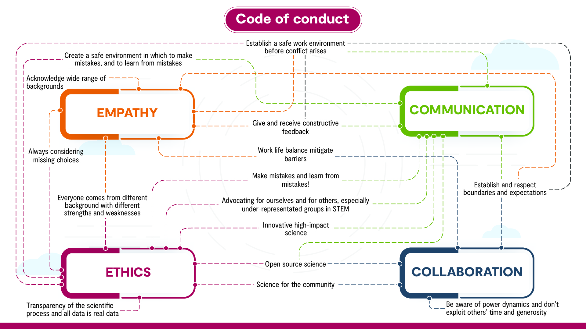

# Where to get [HELP](./HELP.pdf)

Not sure where to turn for coursework, mental health, technical support, and other issues? Check [this handy slide](./HELP.pdf).

# Welcome to the Lab 

First of all, congratulations on making it this far! Regardless of whether you are an undergraduate student working on your first research project or a postdoctoral researcher applying for a faculty position, you are somewhere along a gradient from __passive learner__ to __independent thinker__. This document is intended as a reference to help you make this transition, by laying out expectations and best practices. It is based on my own experience as well as discussions with colleagues. Most of the examples are therefore biased towards a career as a professional scientist. However, this document is above all a guide to working and thinking like a __professional__.  As such, I have consciously tried to keep the lessons general so that the tips, recommendations, and rules of thumb will apply to a broad range of professional activities and career paths that you may choose to follow.

> "Only a Sith deals in absolutes" -- Obi-wan Kenoboi

This manifesto is shaped by my own experiences, which are summarized here: [About Me](./AboutMe.html)

It was inspired by the works of other, particularly [Steve Stearns](http://stearnslab.yale.edu/some-modest-advice-graduate-students) advice and [Ray Huey's](./References/Huey_Reply.pdf) response, [John Thompson](./References/Thompson_Advice.pdf), and others. 

Other perspectives are well worth reading and reflecting upon, particularly with respect to similarities and differences in philosophy. Your experience and opinion will differ too, and that's okay. 

That said, there are a few immutable ground rules for working in the Colautti Lab.

## Colautti Lab Rules

To be part of the lab, you must agree to four rules:

1. Be __ethical__
2. Be __kind__
3. Be __professional__
4. Be __awesome__ and __have fun__!

# Code of Conduct

Our code of conduct defines our values and shared responsibilities. It is a natural extension of the four rules outlined above.

See also follow the [Biology Department Code of Conduct](../Files/BiologyCodeOfConduct.pdf) and the Queen's University [Student Code of Conduct](../Files/StudentCodeOfConduct.pdf).

# Keys to Success

1. Read this Manifesto carefully and regularly. Take the time to absorb and think about the information. 
  + By 'Read Carefully' I mean not just reading, but also making notes with a pen or pencil. The physical act of writing by hand will improve your memory. Then wait a week or two and then organize and type up your notes (a good chance to learn R-markdown). This will help to reinforce your learning.
2. CAREFULLY read the requirements for completing your thesis. 
  + If you are a graduate student, these are in the [Guide to Grad Studies](https://biology.queensu.ca/academics/graduate/guide-to-grad-studies/) on the Biology website.
  + If you are a BIOL 537 honours student, read the [Thesis Guidelines](https://biology.queensu.ca/academics/undergraduate/courses/honours-thesis-course/thesis-guidelines/), and additional information in the coursework.
3. Make a list of everything you have to do.
4. Make a timeline with your best guess for completing each item on your list. Work backward from the deadline to set goalposts that help you stay on track. 
5. Start [your reference letter](./index.html#your_reference_letter). Update it whenever you score a major achievement, develop a new skill, improve on one of the key characteristics, etc. Send this to me whenever you ask me for a reference letter. Never feel bad about asking for a reference letter!
6. Take advantage of the [Academics 101](../Files/Academics101.pdf) online courses. This includes strategies for time management, notetaking, math, writing/editing, and other useful skills

# Health & Time Management

Don't wait until things are dire and hanging by a thread; get help early to develop strategies that will keep you healthy and happy. 

Make an appointment with the [Student Wellness Centre](http://www.queensu.ca/studentwellness/). Their website is also a fantastic resource, with lots of excellent services to help you improve and maintain your personal mental and physical health. For more immediate connections, call [Good2Talk](https://good2talk.ca/) or [EmpowerMe](https://www.queensu.ca/studentwellness/empower-me). If you are an international student you should also be aware of the [International Student Advisors](https://quic.queensu.ca/international-students-and-staff/advising-and-counselling/). Finally, there are [Faith and Spiritual Life](https://www.queensu.ca/faith-and-spiritual-life/home) services on campus.

Family, friends, and personal health (mental and physical) are important. Time taken for family, friends and personal health can help to increase your energy levels and make it easier to focus when you are working. In some cases, one or more of these may require you to take time off from your thesis or to drop it altogether. Don't feel bad about doing this. Science is great but there is more to life, and you can always 'get back on the treadmill' when you are ready. It is actually quite common for academics to take at least one year off -- try polling some faculty and senior postdocs.

Spend your work time working and your relax time relaxing.

__Work when you are at work__. Don't assume that spending long hours in the office/lab means that you are working hard. If you are spending time on social media, email, chatting, texting and other non-work activities then you are not working. 

__Relax when you are not working__. Avoid major time sinks that don't really help you relax -- binge watching Netflix and marathon video gaming are prime examples. Limit your time on facebook and personal email. Instead, take some time to slow cook, exercise, read a book, or attend a concert. Bring a notepad wherever you go. Sometimes a relaxed mind suddenly solves a problem you have been slaving over or inspires a firestorm of new and exciting ideas. Devote a small block of time each day or each week to stay up to date with email and social media, then __TURN IT OFF!__ Constant interruptions have a very strong effect on productivity. Everything in moderation. 

# Colautti Lab Standards

You were not invited to do a thesis in the Colautti Lab because you are a good student. You were chosen because you have the potential to be an outstanding student. This should be your goal, and to help you attain that goal you will always get suggestions for improvement. This can be frustrating and in some cases you may feel like nothing you do is 'good enough'. But you should instead train yourself to view criticism and suggestions for improvement as important and useful feedback that pushes you to constantly improve on your thesis.

## Publishing

Read & Discuss: [Publishing papers while keeping everything in balance: Practical advice for a productive graduate school experience](./References/Hotaling2018PublishingAdvice.pdf) by Scott Hotaling

The ultimate goal of a research thesis in the Colautti Lab is publication in a top peer-reviewed journal. Every thesis student is given a thesis project that that could lead to one or more publications. Whether that happens is up to you. Most undergraduate students do not publish their thesis, and many graduate students publish fewer papers than they could have. To understand why this happens, I introduce the Anna Karenina Principle of thesis publishing:

### Anna Karenina Principle

> "All happy families are alike; each unhappy family is unhappy in its own way."   -- Leo Tolstoy, _Anna Karenina_

If you spend some time reading the top scientific journals, you will see that all good scientific studies are alike; they are the result of excellence in each of a number of areas. Each sub-par paper fails in its own unique way. Some  including:

1. __Framing__ --- This means putting the whole study in context.Why is this study important? What questions does it address? What does it do that no other study has done before? Are hypotheses clearly laid out? What are there key predictions and what is the logic behind them?  A lot of this changes at the writing stage, after data has been collected and analyzed, but it is important to start thinking about it right at the beginning. A good understanding of the relevant historical and cutting-edge literature is crucial to finding a good frame for your study.

2. __Experiment__ --- This is arguably the most important aspect of a good research thesis, particularly for an undergraduate thesis where there is only time for one major experiment.  Other steps such as framing or statistical analyses can be modified over time, and with much less effort than trying to repeat or improve an experiment. This is particularly true for an undergraduate thesis that involves summer field work. In that case, you only have one shot.

  + _Experimental Design_ --- Does your design clearly test your hypotheses? Have you carefully considered potentially confounding factors or interpretations? Are your plans realistic and achievable?
  
  + _Experimental Execution_ --- This is probably the hardest part to any thesis. Were you able to meet all of your experimental goals? How did you deal with problems that arose? Did you make careful observations and meticulously record data? It is rare that an experiment turns out exactly as planned. Learning to deal with the uncertainty and turn a bad situation into good data is more important than completely following through on your design. In some ways, a good execution is like a good physical workout, you need to start with a solid, sustained effort, and then push past the fatigue and your desire to 'just get it done.' Any extra effort you make to get a few extra observations, process a few more individuals, collect a few extra data points will pay high dividends in your final project.

3. __Data Analysis__ --- This step can often be the most challenging for students, particularly undergraduate and Masters thesis students who may have little experience in data analysis outside of a perscribed classroom setting. Additionally, the __Reproducibility__ and __Open Science__ standards, adopted by the Colautti Lab, require that all data manipulation and analyses are 'hard-coded', for example as custom scripts in the R programming language. Fortunately, there are many tools to help you, including the [Colautti Lab Resources](http://Colauttilab.github.io) website. A much more difficult problem is figuring out the best way to analyze your data. In the process, you will realize that good data analysis is as much art (picking the methods and graphing the data) as it is science (correctly applying the chosen analyses). Working through methods in recent papers from top journals that analyze data similar to yours is a crucial first step.

4. __Writing__ -- The importance of good writing is almost always underestimated by students and even many established scientists. Even if an experiment is well designed, flawlessley executed, and analyzed using cutting-edge methods, still has to be communicated to a scientific audience. A well-written thesis or publication requires careful planning and an unrelenting consideration of how and why particular words are chosen. This translates to many stages from rough outlines, to many (many!) revisions. Even if you are a good writer, and you have completely finished your experiment and analysis, it will almost certainly take you more than 3 months to write a paper that is ready for peer review. This assumes a relatively straight-forward experiment that is easy to explain and does not contain overly complex methods. More sophistocation (or more co-authors) requires more time. 

5. __Presentation__ -- By 'presentation' I mean all forms of presentation, including posters and oral seminars at international conferences, as well as peer-reviewed publications and press releases. Steps 1-4 have taken a tremendous amount of work, but your effort may go completely unnoticed if your key results don't cut through the background noise generated by the thousands of scientific papers that are published every month. Each medium is different, and each form of presentation requires you to think about your target audience --- their knowledge, interests, and even their biases.

6. __Dissemination__ -- This is increasingly important in the modern world in which a deluge of mediocre scientific research make it harder for researchers and the public at large to find results that may be of interest to them. Many of us now turn to social media and science-based news reports to learn about new and interesting findings. Moreover, funding agencies are increasingly looking at metrics other than publication number, to determine if other scientists are actually reading and citing your research. You have gone through so much work to put together a good paper. Now you need to help others find it. If they think it is good and important work they will cite it. 

### Final Note ###
Although this list roughly follows the order that these steps are developed, a good research thesis constantly revists each step. For example, updating or adding more experiments or analyses, or changing the questions to modify the framing. It is like a giant mental puzzle where the pieces are not completely formed and you want to make them fit as tightly as possible.

# Roles and Expectations

The roles of the graduate student and supervisor are laid out in the [Graduate Supervision Policy](../Files/Supervision_Roles_2022.pdf)

Some key points from this document:
  
  1. The primary role of a graduate student is to **focus on learning and research**.
  2. There are many policies that you need to read, which are linked in the document, especially the [Guide to Graduate Studies in Biology](https://biology.queensu.ca/academics/graduate/guide-to-grad-studies/) on the Biology Website
  3. Discuss any circumstances that could affect performance or progress.
  4. Keys to success: Mutual respect, open/honest communication, setting and attaining goals, timely feedback, maintaining wellness.

## Mentor/Advisor

My role is to provide you with the environment, training and resources you need to flourish as a professional researcher. My choice of the terms __mentor__ and __advisor__ rather than __supervisor__ is a deliberate attempt to stress that I am here to offer guidance if you ask for it, but I won't be looking over your shoulder constantly to make sure you are doing well. As a __mentor__, I try to share my experience and expertise to help you to build on your strengths and overcome your weaknesses, to produce research that is read, understood, and respected by the world's top scientists. To make this possible, my time and energy are devoted to a number of duties:

1. __Direction__ -- identifying avenues of research that are most promising given our current resources and expertise.
2. __Resource management__ -- writing grant applications (financial resources), attracting top-notch people like you (human resources), and allocating the most productive people to the most promising projects.
3. __QA/QC__ -- making sure that the quality of the science done in the lab is world-class. This includes establishing and constantly revising best-practices in the lab and the field, in data analysis, and in writing. I try to act as as a filter to help you improve your success in the rigorous world of scientific peer review. The good news is, it's not as hard as you think! It really just requires focus, (lots of) time, and persistence.
4. __Teaching__ -- developing and modifying course content to teach and to challenge students.
5. __Service__ -- contributing time and energy to meetings and committees that are necessary for a well-functioning Biology Department, University, and Community.
6. __Dissemination__ -- helping other scientists and the general public to learn about the work we are doing, and why it is important.

## Mentee

As a __mentee__, your primary duties include:

1. __Reading(!)__ -- The most successful mentees read often and read widely to get a broad understanding of research and to maintain a general perspective. In addition, re-read papers in your own research area to develop a deep understanding of the state-of-the art in methods and analysis, and the big open questions. Here are a few specific tips

    + __Schedule__ large blocks of time to devote to reading. If you have a heavy workload you may have to limit this to 3 or 4 hours a week, otherwise you should spend 2-3 hours per day.
    + __Subscribe__ to email alerts for the best journals. Scan the titles quickly to identify relevant papers and save a link to the paper for your scheduled reading times.
    + __Take notes__ and summarize what you read in an organized document. Use an electronic format (e.g. OneNote, EverNote, or R-Markdown) so that they are easily searchable. A good strategy is to write notes by hand and then later organize and type them up. This is a good way to reinforce your learning and retention. These electronic notes also become valuable for sharing with your collaborators, including volunteers helping with your project who would like to learn more.
    + __Identify__ the top scientists in your area. Pay attention to names that come up repeatedly in papers and figure out which names are principal investigators, rather than graduate students or postdocs. Ask your peers (including me!) what they think of the quality of the science. Pay close attention to their research methods. 

2. __Project management__ -- As the project manager, you are ultimately responsible for developing your project plans and implementing them. As noted above, my role is to provide feedback, maintain quality, and help you get the resources you need to successfully implement your project. If you are early in your career (e.g. 537 Thesis project), your goals will be more clearly defined than if you are a senior graduate student or postdoc. However, regardless of the stage you are at, you are responsible for planning and implementing your experimental design and data collection. 

3. __Skill development__ -- Success requires development of a number of important skills. Many of these come with experience, but there are also a number of excellent books you can read to help you avoid making critical errors. These specific skills are discussed in more detail elsewhere, so here is a very brief introduction:

    + __Problem solving__ -- hopefully you have lots of experience with this now. Continue to nurse your instincts to break down complex problems into simpler, testable components.
    + __Experimental design__ -- a lot has been written on this; you should also pay close attention to the methods used by the leaders in your field of research.
    + __Data collection__ -- careful bookkeeping is absolutely crucial. Learn to think like a computer and take good notes. Record everything electronically as soon as possible and make multiple copies in multiple places (computer + external hard drive + 'the cloud')
    + __Analysis__ -- the details of a particular analysis (e.g. linear model in R) can be technical and straight-forward, but exploring your data and identifying the best tools to use can be more of an art form. Here again, paying attention to the analyses used by the leaders in your field will provide a good starting point.
    + __Communication__  -- whether __oral__ or __written__, there are a lot of great resources for learning about effective communication. Good science communicators spend most of their time planning and editing, rather than writing or laying out slides.

# Transferrable Skills

There is currently a lot of discussion about the job market facing modern graduate students and the need for transferable skills. It is helpful to keep these in mind when working through your thesis and applying for jobs. The skills most valuable both inside and outside of academia include:

1. __Scientific communication__ -- Tends to focus on quantitative results and careful consideration of alternative hypotheses (e.g. peer-reviewed publication)
2. __Public communication__ -- Requires simplifying complicated data, analyses and concepts. Analogies or specific examples are often helpful. Also requires careful consideration of the audience and why they should care about your research (e.g. press release for your paper). 
3. __Writing__ -- A good understanding of language and grammar is just the beginning. Understanding how to organize your thoughts into a coherent argument with a logical flow and effectively communicate those ideas concisely. 
4. __Presentation__ --  How to present results and ideas in a way that is visually compelling. e.g. figures in a paper or powerpoint presentation.
5. __Oral communication__ -- When presenting at public lectures or presentations at scientific conferences, understand the interests and expertise of your audience and simplify complex results and concepts as needed.
6. __Leadership and mentoring__ -- Are students helping with your project(s)? If so, you can treat them as basic labourers or you can use the opportunity to build mentoring skills to be an inspiring mentor.
7. __Experimental design__ -- Design an experiment that effectively tests an important question or hypothesis, while incorporating or controlling for other confouding factors.

Perhaps more importantly, several skills that are highly valued by employers are generally lacking in recent graduates. Focusing hard on these can give you a big edge:

1. __Data science__ -- Use basic programming (especially in R or Python) to explore data, run statistical analysis, and produce graphs that help to explore and interpret the data, particularly in terms of hypothesis testing. 
2. __Laboratory methods__ -- Learn basic lab techniques, but more importantly learn how to focus, build in quality control checks, and troubleshoot long or difficult protocols.
2. __Big data__ -- Use high-performance computing, command-line programming in Unix, basic bash script programming, and other tricks for working with large datasets.
3. __Science policy__ -- Effective policy must deal with inherent uncertainty in scientific discoveries and balance those with social aspects like competing philosophies and priorities of people from different demographic, ethnic and economic backgrounds. 
4. __Governance__ -- Incorporate input from competing interests to craft effect policies. In addition to student-run organizations, most department and university committees need volunteer student representatives.
5. __Time management__ -- Use a calandar. Organize your time carefully at the hierarchy of year, month, week and day.  
6. __Project management__ -- Organize a team and allocate their time effectively to complete your project on schedule.
7. __Budget management__ -- Even if you don't have your own research funds, you can still create a budget for your project, and make decisions about the most effective use of valuable research funds.

> Maintain a self-evaluation to keep track of your skills and accomplishments. 

As you work through your degree, look for opportunities to work on these, and make note of them in your document. When you ask somebody for a reference letter, you can point to these specific examples as a reminder of what you have learned and accomplished.

## Benefits of a PhD

Doing an advanced degree can be stressful. The workload and stress can sometimes cause us to forget the benefits of a degree. A recent (2022) [paper in eLife](https://elifesciences.org/articles/81075) from Franck Courchamp's group highlights the positive aspects of being a PhD student. 

Figure 2 of the paper gives a nice overvew.

> The three primary benefits of doing a PhD are acquiring expertise (pink circle), learning to work in a collaborative environment (blue), and developing communication skills for sharing knowledge (yellow). For each benefit, general aspects that apply to almost all doctoral students are shown in bold type in the small circle, and specific aspects that depend on, for example, the student’s supervisor or field of research are shown in plain type in the large circle. The large grey area contains more abstract and subjective ideas that are not discussed in the main text. It should be noted that this figure is conceptual, and that the aspects and ideas in it could be grouped in other, equally valid, ways.

# Your Reference Letter

As you progress in your professional development, academic grades become less relevant. Instead, you are judged by your contributions and by the assessment of your peers. This can be tricky because you no longer get the kind of feedback that you get from a test score. Therefore, it is important to understand how you will be assessed and stay mindful of this in everything you do. As a general rule of thumb: aim for excellence and try at all times to think and act in a professional manner. 

To really understand what it means to be a professional -- and why it takes so much time and focus -- it is helpful to think about your reference letter. For example, look carefully at the criteria for CIHR and NSERC scholarships:

## Requesting References

Faculty receive many requests for reference letters, often in waves that correspond to major application deadlines. Having a strong reference letter can be just as important as a strong CV, so supporting your letter writer can have a big impact on your chance of success. Here are some tips:

1. **Plan ahead**. It's never too early to plan for a major award (e.g. NSERC/CIHR/SSHRC) but at a minimum you should plan more than two months ahead, completing a solid draft of everything *before* you request a reference -- typically 4 weeks before the deadline.

2. **CV**. Put together a CV. A CV is like a Resume but focuses on accomplishments. Look at the scholarship criteria and organize your CV to put the most important accomplishments near the top.

3. **Review**. In addition to the specific and concrete accomplishments that go into your CV, make a list of the transferable skills that you have developed, and how your CV demonstrates these skills. If you have a skill that is not supported by your CV, maybe there is something you can add to support this skill.

4. **Talking Points**. Major scholarships have guidelines for your reference writers -- see the next section for examples. Make a list of talking points and send these your reference writer. Talking points are point-form statements drawing attention to particular aspects of your application that speak to particular evaluation criteria. For example, the guidelines below include three major sections of the reference letter, which you can use as headings in your talking points document. Be sure to **focus on evidence** -- use facts and examples, not superlatives. Don't just re-iterate what is already on your CV or transcripts without context: 

| **Bad** | **Good** |
|------------|--------------------------------|
| Got an A+ in Biol 343 | A+ in Biol 343 demonstrates mastery of coding and linear models for biological applications |
| Thesis applied cutting-edge genomics tools | I wrote customized the DADA2 pipeline in R to process 12TB of amplicon sequencing data |
  
5. **Be Professional**. Be sure to give enough lead time when requesting a reference letter -- typically > 4 weeks before the deadline. Include your CV, (unofficial) transcripts, and talking points. Also include some basic reminders -- when did your reference first get to know you and in what capacity? Which of their classes did you take? 
  
6. **Reminders**. It's okay to send friendly reminders to your reference writer until they submit their letter. About once per week is good, until the final week, when more frequent reminders may be needed.
  
7. **Don't be shy**. Put your best foot forward. If it feels too weird promoting yourself, try writing your talking points in the third person as if you are writing about somebody else. Focus the positive and report accomplishments, rather than superlatives. Don't under-sell your skills or focus on the negative. But don't bullshit either. Learning to highlight your accomplishments in a detached way is an important skill in any professional career! 

> Note: If you are asking Rob Colautti for a reference, the above are essential, particularly for requests close to the deadline.

## CIHR Scholarships

### 1. Academic Excellence

(max 2250 characters) Provide an assessment of the candidate’s academic excellence as demonstrated by past academic results and by transcripts, awards and distinctions. Since the review committee is multidisciplinary, please provide an assessment that references the norms and expectations of the student’s discipline. If applicable, please also comment on results achieved outside of the university environment.

### 2. Research Potential

(max 2250 characters) Provide an assessment of the candidate’s research potential as demonstrated by their research history, interest in discovery, the proposed research and its potential contribution to the advancement of knowledge in the field and any anticipated outcomes. Include examples to support your assessment in comparison to the norms particular to the research area(s) (e.g. publication norms for the discipline etc.)

### 3. Leadership

(max 4500 characters) Provide an assessment of demonstrated and potential leadership ability. Because there is no opportunity to interview the students, please elaborate for the committee how the candidate has gone above and beyond the opportunities presented in order to achieve a goal, contribute to their community, or how they have taken on responsibility for others. Note that high achievement, while admirable, does not necessarily constitute leadership. Be sure therefore to provide context for the committee that illuminates how the candidate’s participation in activities (e.g., volunteer or work, sport or art, and any other participation) goes above and beyond active participation and becomes leadership.

## NSERC Scholarships

Provide a percentage rating and comments for the following three selection criteria—the applicant’s strengths and limitations should be assessed, including examples of the applicant’s accomplishments and contributions to support your assessment:

### 1. Academic Excellence

  * Academic excellence, as demonstrated by past academic results, transcripts, awards and distinctions:
    * Rating: Top 2%, Top 5%, Top 10%, Top 25%, Below Top 25% or Unable to comment
    * Provide a written assessment of the applicant’s skills, abilities, achievements, awards, experience and contributions related to this criterion; use concrete examples (2,400 characters maximum, including spaces)
  
### 2. Research Potential

  * Research potential, as demonstrated by the applicant’s research history, their interest in discovery, the proposed research, its potential contribution to the advancement of knowledge in the field and any anticipated outcomes:
    * Rating: Top 2%, Top 5%, Top 10%, Top 25%, Below Top 25% or Unable to comment
    * Provide a written assessment of the applicant’s skills, abilities, achievements, awards, experience and contributions related to this criterion; use concrete examples (2,400 characters maximum, including spaces)

### 3. Personal Skills

  * Personal characteristics and interpersonal skills, as demonstrated by the applicant’s past professional and relevant extracurricular interactions and collaborations:
    * Rating: Top 2%, Top 5%, Top 10%, Top 25%, Below Top 25% or Unable to comment
    * Provide a written assessment of the applicant’s skills, abilities, achievements, awards, experience and contributions related to this criterion; use concrete examples (2,400 characters maximum, including spaces)

## Other Scholarships

There are many other awards that require reference letters. Be sure to look for the criteria for reference letters, similar to the criteria shown for CIHR and NSERC, above. Keep these criteria in mind when you are putting together your application.

## Other considerations

One thing you should note is that grading has changed from an absolute scale (e.g A-->F) to a relative scale. Most graduate students will successfully defend an thesis and achieve an A in all of their courses, but only 1 in 50 will be in the top 2%. To obtain fellowships you will need to be at least in the top 10% in each category, and the top 2% or 5% in most of them. Being average (top 50%) is not likely to be competitive.

These are high standards, and you will only achieve them if you are passionate about your work and embrace the discomfort that comes from acknowledging your weaknesses and always pushing yourself to improve on them. 

# Don't Panic!

Everything will seem hard at first, and even the simplest tasks will take a long time. You will wonder how anyone ever gets anything done when it takes so long to do even the most basic things (e.g. write a carefully-worded email to a faculty member). I will tell you a big __secret__ about this: the more you do it, the faster it gets. The first time usually takes the longest, the hundredth or thousandth time is much faster. 

> Summary: Aim for perfection, publish along the way

# Thesis vs. Coursework

Coursework usually involves getting cookie-cutter exercises with clear starting points and expected outcomes. In contrast, you are now in charge of your own research project with open questions and uncertain answers.  

The research thesis is fundamentally different from the coursework that makes up the majority of your undergraduate education. Here is a simplistic breakdown:

 1. __Lectures__ -- __transfer knowledge__ from professor to student

 2. __Flipped / Active Learning__ --- __reinforce learning__ of concepts from textbooks, lectures and other sources 

 3. __Research Thesis__ --- __generate new knowledge__ by applying relevant knowledge, including experimental design, statistics, and the scientific method.

The difference between an undergraduate class and a thesis project is similar to the difference between reading something in a textbook and understanding a topic deep enough that you can observe and discover something new to add to the textbook that future students will learn from. It is not an easy thing to do well. 

Some of the common strategies you relied on as a student will not help at this stage in your career. But you knew these were bad habits anyway:

* Finding the 'right' answer
    + There are no exams or assignments from previous years. Each project is different.
* Searching for the answer on Wikipedia
    + Wikipedia is great as a starting point for brushing up on definitions and equations, but it won't help you think independently.
* Late night cram sessions
    + Total recall might be good for an exam but it's not much help with a thesis.

Instead of memorizing textbook definitions and anticipating test questions, your time will be occupied thinking and reading about a wide range of topics, with countless additional hours scouring the methods, results and discussion of papers that are most relevant to your project. This will occur most intensively at the beginning of your project, as you bring yourself up to speed, and toward the end, as you write your results for peer review. In between, you should spend time reading and discussing papers with your peers (e.g. in lab meetings). In this way you can gain a deeper understanding of what makes for a good scientific study.

***

# What to expect

1. __A Lot of Work__! Much more work than any undergraduate class. Even a 537 project, if done well, requires much more work than the 4 course credit equivalents that you will receive. It's a high price but the benefits are also much higher -- a solid reference letter from your supervisor and committee member, and a peer-reviewed publication can be much more important for a professional career (e.g. law, medicine, graduate school, career scientist) 

2. __Uber Standards__. Every aspect of your work is scrutinized, from the most mundane details of your experimental design and analysis, to your ability to think about the 'big picture' and what your research contributes to the scientific community.

3. __Anna Karenina Marathon__. It is easy and very common to lose motivation or focus over the course of your project. If this happens, your probability of getting a publication will dwindle. Find ways to support your mental and physical health to avoid 'boom and bust' cycles and a decline in motivations.

4. __No 'Right' Answer__. Just a lot of questions to try to answer. In fact, sometimes the best thesis raises more questions than it answers. 

5. __Science Comprehension__. You will develop a more intimate and deeper understanding of all aspects of science, including the importance of social interactions, the many paths to a successful study, and why so many published studies are unreliable.

6. __New Friends__. You will meet many other students, faculty and postdocs who are as enthusiastic as you are about science. 

# Getting Started:

Make a timeline to help yourself stay on track. Be sure to include specific items like data collection, planning, lab/field experiments, writing, etc. A lot of these will be unique to your thesis but here are some things common to most:

## Checklist

- [ ] Sign the graduate student contract
- [ ] Background Reading
- [ ] Thesis committee formation
- [ ] Thesis proposal & presentation
- [ ] Annual committee meeting (usually fall semester)
- [ ] NSERC & OGS application deadlines (September)
- [ ] Analysis (one per section/chapter)
- [ ] Writing (one per section/chapter)
- [ ] Editing (one per seciton/chapter)
- [ ] Defence
- [ ] Manuscript writing
  
On top of this, you will have to remember to leave enough time for other committments like TA responsibilities, coursework, online training (ethics, lab safety, WHMIS)
  
## Design Your Project

There are lots of things to think about when designing your project. Simply writing things down and thinking about them helps to keep you focused and organized, and gets the creative juices flowering. Here are two approaches recommended in a [blog post by Dr. Kamoun](https://kamounlab.medium.com/gohrep-and-plesi-guides-to-navigate-through-your-research-projects-ae354a21f1bc). It's worth reading the whole thing, but here is a brief excerpt/summary:

### GOHREP

GOHREP stands for **GO**al, **H**hypotheis, **R**ationale, and **E**xperimental Plan:

  1. **Goal** — here you write your main objective; what do you want to achieve in the project; achieving this goal is what defines the success of the project. After all, how would you ever reach your goals if you never write them down in the first place. Here, you can be somewhat general but not too vague.
  2. **Hypothesis** — a hypothesis is a statement of a fact, an educated guess; it is central to scientific thinking so make sure you are familiar with the concept and read about it. The hypothesis needs to be specific, it is typically more specific than the overall goal.
  3. **Rationale** — this is your logic for coming up with the hypothesis. The hypothesis rarely comes out of thin air but is the product of some background information or finding you have. Here, you describe the finding or observation that led you to make the educated guess of the hypothesis. Typically, the rationale is based on preliminary data.
  4. **Experimental plan** — This is your to do list for the lab. Here, you write the approach and which specific experiments you will you undertake to challenge the hypothesis with the ultimate goal of achieving your objective. Please, note that a typical approach in science is to design experiments that aim at falsifying your hypothesis. You’ll be on the right track as long as your hypothesis stands these repeated experimental challenges; otherwise, no worries mate, you simply need to get back to the drawing board and come up with a new hypothesis.
  
### BBQ 

BBQ is the **B**ig **B**iological **Q**uestion(s). How does your project fit into the 'big picture'? What is interesting about your research area, more broadly? Why do other people work in this area? 

### PLESI

PLESI stands for **PL**anning, **E**xecution, **S**coring, and **Interpretation**

  1. **Planning** is figuring out what you are going to do and when, what to prioritize and what timeline you will try to follow.
  2. **Execution** is getting things done according to the plan. The skills needed to execute are constantly changing so learn what you need to execute your plan.
  3. **Scoring** is coding your data into a format that can be easily analyzed. If you have some R/programming background this will be obvious. If not, it's a good idea to take some time to learn. Start with the [R Crash Course](https://colauttilab.github.io/RCrashCourse/1_fundamentals.html) and then work through the [Intro to Linear Models](https://colauttilab.github.io/RIntroStats/1_Distributions.html) -- including all of the indivdual lessons across the top. **IMPORTANT**: Scoring also includes making keen observations; your experiment may not produce the results you expect, but could reveal something else of interest. Serendipity! 
  
# *Acknowledgements*

These documents were written in collaboration with the following fantastic people:

  * Mia Akbar
  * Damian Bourne
  * Aaron Dain
  * Lisa Han
  * Nicolai Hermann
  * Andrew Le
  * Charlotte Ngo
  * Maria Jose Gomez Quijano
  * Mabel Fuentes Vergara
  * Sherise Vialva

  
  
