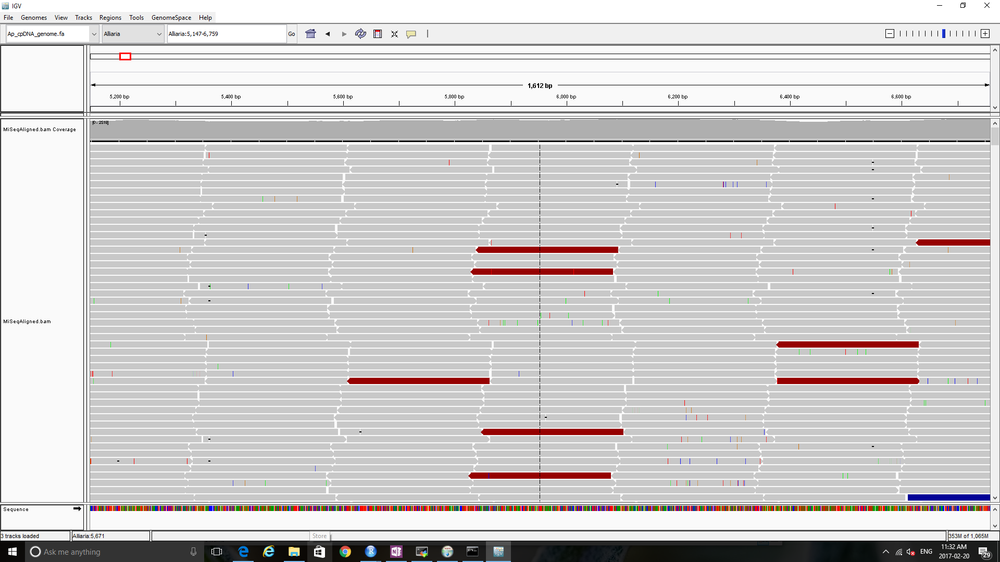

```{r setup, include=FALSE}
knitr::opts_chunk$set(echo = TRUE)
```

## Overview

__NOTE:__ This is being updated with newer programs (e.g. HISAT2 instead of BOWTIE)

In this tutorial you will learn about the __TUXEDO SUITE__ of tools for sequence alignment and RNA expression analysis. This involves several tools:  

1. __BOWTIE2__ -- A very fast, memory-efficient short-read aligner. Use for aligning short DNA sequences to a reference genome. This is the first step in variant detection for GWAS, QTL mapping, and a host of population genetics analyses. [LINK](http://bowtie-bio.sourceforge.net/bowtie2/manual.shtml)
2. __TOPHAT2__ -- Maps RNA sequences to a reference genome to assist with annotation and identify spliced sequences. Can also run de novo alignments when a reference genome is not available. [LINK](http://ccb.jhu.edu/software/tophat/index.shtml)
3. __CUFFLINKS__ -- a set of tools for analysis of RNA transcripts [LINK](http://cole-trapnell-lab.github.io/cufflinks/manual/)  
  3a. __cufflinks__ -- assemble transcripts  
  3b. __cuffcompare__ -- compare assemblies to annotation  
  3c. __cuffmerge__ -- merge two or more transcript assemblies  
  3d. __cuffdiff__ -- identify loci with differential expression; detect alternative splicing and
  promoter regions  
  3e. __cuffnorm__ -- normalize expression levels
  3f. __cuffquant__ -- save gene and transcript profiles to files for use with __cuffdiff__ and __cuffnorm__
4. __CUMMERBUND__ -- a package in R for analyzing gene expression variation. [LINK](http://compbio.mit.edu/cummeRbund/)
  
## BOWTIE2

Let's begin by mapping reads from our Illumina MiSeq short reads to our chloroplast reference genome. Start by loading the __BOWTIE2__ package and then taking a look at the help file. 

```{r, engine = 'bash', eval = FALSE}
$ use bowtie2
$ bowtie2 --help
```

Take a second to think about the computation required to align a few hundred million short reads, each requiring a match of a few hundred bases long, to a reference geneome that may be hundreds of millions to billions of bases long. To keep memory requirements from getting out of control (i.e. GB instead of TB), Bowtie uses something called the Burrows Wheeler Transform [LINK](https://en.wikipedia.org/wiki/Burrows-Wheeler_transform).

### Index the genome

__BOWTIE2__ also requires the reference genome to be indexed. Indices for well-studied organisms are available online, but in our case we'll have to create an index for our reference chloroplast genome. This can take a while for larger genomes but only has to be done once to create the index files. Since several files are created, it is helpful to keep the genome and all the associated indices in a separate folder, which should already been created in the _tuxedo.tar.gz_ file:

```{r, engine = 'bash', eval = FALSE}
$ ls -l ./Ap_genome
```

```{bash eval = FALSE}
total 791
-rw-r--r-- 1 hpc3183 hpcg1540 400153 Feb 20 08:44 Ap_cpDNA_annotation.gff
-rw-r--r-- 1 hpc3183 hpcg1540 153259 Feb 20 08:44 Ap_cpDNA_genome.fa
```

Note the fasta file with the _.fa_ extension, which contains the draft chloroplast (cp) sequence as a single contig.  
  
To index the cp genome, run the _bowtie2-build_ program. Since the genome is small, we could do this from the command line. However, for most genomes (100 Mb+) you would want to put this into a bash file, so let's do that.  
  
Create a new bash file called _genindex.sh_ text file with your favorite text editor:

```{r, engine = 'bash', eval = FALSE}
nano genindex.sh
```

Now enter the usual header of the bash script:

```{r, engine = 'bash', eval = FALSE}
#! /bin/bash
#$ -S /bin/bash
#$ -cwd
#$ -q abaqus.q
#$ -l qname=abaqus.q
#$ -m e
```

Then choose the names of the output files and tell the scheduler to load the __BOWTIE2__ commands:

```{r, engine = 'bash', eval = FALSE}
#$ -e genindex.err
#$ -o genindex.out

use bowtie2
```

Exit and save, then take a quick look at the _bowtie2-build -h_ file. You'll see that, at a minimum, we need to specify the location of the genome file, and set a file prefix for the output (index) files. It's important to remember that the cp genome is in a folder called _Ap_genome_. Since we set __-cwd__ in the bash file, we have to be careful to either use the path that is relative to the directory that we will submit the script from, OR use an absolute path. Let's re-open the _genindex.sh_ script and add the relative path in the bash script:

```{r, engine = 'bash', eval = FALSE}
bowtie2-build ./Ap_genome/Ap_cpDNA_genome.fa ./Ap_genome/Ap_cpDNA_genome
```

Exit and save changes to the bash script. In this case, we want to be sure to submit the script from the parent directory that contains the _Ap_genome_ directory. Be sure to exit and save your changes. Then, submit the script using qsub:

```{r, engine = 'bash', eval = FALSE}
$ qsub genindex.sh
```

After the job is completed, there should be output files (__.err__ and __.out__), which we can inspect to make sure that everything ran smoothly. Running logs with any warning and error messages generated by the programs we run in our bash script will appear here:

```{r, engine = 'bash', eval = FALSE}
$ nano genindex.out
$ nano genindex.err
```

There should also be several new index files in our genome folder:

```{r, engine = 'bash', eval = FALSE}
$ ls -l ./Ap_genome
```

### Align DNA sequences

Now that we have an indexed reference genome, we can use __BOWTIE2__ to align our MiSeq DNA sequences to it. We'll do this for the same MiSeq data that we used in our __de novo genome assembly__ tutorial. Let's start with another bash script that we'll call _MiSeqAlign.sh_:

```{r, engine = 'bash', eval = FALSE}
$ nano MiSeqAlign.sh
```

Enter the usual first few lines, with custom output file names, then load the BOWTIE2 commands:

```{r, engine = 'bash', eval = FALSE}
#! /bin/bash
#$ -S /bin/bash
#$ -cwd
#$ -q abaqus.q
#$ -l qname=abaqus.q
#$ -m e
#$ -e MiSeqAlign.err
#$ -o MiSeqAlign.out

use bowtie2
```

Now we add the __bowtie2__ command, specifying:  

1. the index prefix (__-x__) for the genome and the index files (note path is within _Ap_genome_ directory).
2. the MiSeq mate-pairs (__-1__ and __-2__) specifying two files for the 1-forward and 2-reverse reads.   
3. __-S__ specifying a name for the output __SAM__ file.  

We'll also break up one long line into several lines using the backslash, to make the script more readable:

```{r, engine = 'bash', eval = FALSE}
bowtie2 -x ./Ap_genome/Ap_cpDNA_genome \
-1 ../deNovo/MiSeqF.fq -2 ../deNovo/MiSeqR.fq \
-S MiSeqAligned.sam
```

Note that we are using the short-read sequences from the de novo tutorial, which in a different directory. Using the __../__ tells the scheduler to go to the parent of the current directory, then the __deNovo/__ tells it to go into the deNovo folder.

We won't run this script yet because it will take a little while to run. Even with the small genome size, the index, and the B-W transform, the run time is still long. 

> Why does this script take a while to run? 

Many common programs that work with next-generation sequencing data involve iterations that repeat the same function or analysis over and over again (e.g. aligning a bunch of sequences). Many of these programs can take advantage of multiple processors to decrease the runtime.

For example, let's search the __bowtie2__ help file for a parameter that allows us to specify the number of __threads__ (computer processors). If you have a very long help file, sometimes you can search for a string using the grep command:

```{r, engine = 'bash', eval = FALSE}
$ bowtie2 --help | grep 'thread'
```

Note the vertical line __|__ or __pipe__ character in the command above. This is a very useful __UNIX__ command that says 'take whatever is output from the command on the left side of the pipe and use it as input for whatever is on the right side'. So in this case, it is taking the output from the __help__ command and inputting it into the __grep__ command to search for the string 'thread'.  
  
The __grep__ command uses __Regular Expressions__ or __REGEX__, which is a very powerful set of syntax rules for searching text. We don't have time to go into this in detail, but there are many tutorials online. I've also written one for R: [LINK](http://post.queensu.ca/~rc91/R/4_regex.html)

After running the above command you should see this line:
  
```{bash, eval = FALSE}
  -p/--threads <int> number of alignment threads to launch (1)
```
  
If you look at the output from the command above, you'll see a single line from the help file, telling us that we can use __-p__ or __--threads__ as a parameter in the __bowtie2__ command to run in parallel. If you recall from the de novo assembly tutorial, we do this by adding a line to the header of the bash script (__#$ -pe shm.pe 8__), where 8 is the number of threads we want to use. Then we use __$NSLOTS__ with the __-p__ parameter in the actual script. Do this and then use __qsub__ to submit the script. It may take a few minutes to run.

> Run time may be 20+ min. Take the time to ask questions.

When it is done running, use __ls -l__ to inspect the output. You'll see a very large __SAM__ file (>1GB):

```{bash, eval = FALSE}
-rw-r--r-- 1 hpc3183 hpcg1540 1047343144 Feb 20 09:46 MiSeqAligned.sam
```

We were introduced to __SAM__ files in the de novo assembly tutorial, but let's take a more detailed look at this file format. Recall the warning from the de novo assembly tutorial: if we try to use a standard text editor we are going to use up a lot of memory and may crash our computer. Instead, we should us __head__, __tail__ or __less__ to inspect the file. Let's use __head__ to look at the first few lines: 

```{r, engine = 'bash', eval = FALSE}
$ less MiSeqAligned.sam
```

The __SAM__ file is just like a large spreadsheet, with tabs delimiting the columns. You can use the right arrow to scroll across to get a better sense of this.

The first three lines begin with the __&#64;__ symbol and specify the header of the file:  
  
* __&#64;HD__ -- The header line
    + __VN:__ Version number of the alignment (not the __BOWTIE2__ program)  
    + __SO:__ Sorting order (usorted)  
* __&#64;SQ__ --  Reference sequence dictionary
    + __SN:__  Reference sequence name (taken from first line of __FASTA__ file)
    + __LN:__  Length of the reference sequence
* __&#64;PG__ --  Program info
    + __ID:__ Program ID
    + __PN:__ Program name
    + __VN:__ Program version
    + __CL:__ The command line used to generate the alignment (compare with MiSeqAlign.sh)  

The fourth line shows the data for the first alignment:  
  
1. __QNAME__ -- The name of the sequence; from the __FASTQ__ file
2. __FLAG__ -- a bit-score FLAG; explained on Wikipedia page [LINK](http://genome.sph.umich.edu/wiki/SAM)
3. __RNAME__ -- Name of the reference alignment (from __FASTA__ file)
4. __POS__ -- Mapping position (location along reference) 
5. __MAPQ__ -- Quality score for the mapped sequence (probability of correct match)
6. __CIGAR__ -- A code specifying things like mismatches, insertions and deletions. Note the __=__ represents a perfect match
7. __RNEXT__ -- Name of the mate pair read 
8. __PNEXT__ -- Position of the mate pair read
9. __TLEN__ -- Length of the template 
10. __SEQ__ -- Actual sequence of the mapped read
11. __QUAL__ -- Quality the original sequence (same Q-score from from __FASTQ__ file)

The last set of columns are optional __TAGS__. For more detail, see the official __SAM__ specification info. [LINK](http://samtools.github.io/hts-specs/SAMv1.pdf)

In the de novo assembly tutorial, we talked about the difference between text-based __SAM__ file and the binary __BAM__ version. While __SAM__ files are human-readable, __BAM__ files are much smaller and faster for the computer to work with. We can convert them using the __SAMTOOLS__ program:

```{r, engine = 'bash', eval = FALSE}
$ use samtools
$ samtools sort MiSeqAligned.sam > MiSeqAligned.bam
```

It will take a few minutes to run. After it is complete, compare the file sizes.

> How much smaller is the __BAM__ file compared to the __SAM__ file?

The __SAMTOOLS__ program is actually a collection of several very useful programs (aka tools), just like the __PICARD__ program we looked at briefly in the de novo assembly tutorial. We can use these to inspect our alignment. The __flagstat__ tool gives us a report based on the __FLAG__ column in the __SAM__ file (Col #2)

```{r, engine = 'bash', eval = FALSE}
$ samtools flagstat MiSeqAligned.bam
```

```{bash, eval = FALSE}
1599134 + 0 in total (QC-passed reads + QC-failed reads)
0 + 0 secondary
0 + 0 supplementary
0 + 0 duplicates
1552016 + 0 mapped (97.05% : N/A)
1599134 + 0 paired in sequencing
799567 + 0 read1
799567 + 0 read2
1520076 + 0 properly paired (95.06% : N/A)
1537634 + 0 with itself and mate mapped
14382 + 0 singletons (0.90% : N/A)
0 + 0 with mate mapped to a different chr
0 + 0 with mate mapped to a different chr (mapQ>=5)
```

Note that we have no real errors since we were aligning sequences that were already filtered for quality and alignment to the chloroplast genome.

Another thing we might want to do is to index our __BAM__ file so that it can be used with a genome browswer like IGV [LINK](http://software.broadinstitute.org/software/igv/). This creates a __BAI__ or 'bam index' file with the .bai extension.

```{r, engine = 'bash', eval = FALSE}
$ samtools index MiSeqAligned.bam
```

The alignments can't be viewed directly on the cluster, but the following files can be copied to a computer with a visual interface for use with a genome browser like IGV:

1. __Reference genome:__ ./Ap_genome/Ap_cpDNA_genome.fa
2. __BAM alignment:__ MiSeqAligned.bam
3. __BAM index:__ MiSeqAligned.bam.bai

. When opened with IGV, it looks something like this:

  


Our coverage is very high so it's easier to see if we scroll down to the end of our aligned sequences:


Each little grey bar shows the alignment and orientation of one of the short reads. Coloured vertical bars show SNP variants relative to the reference genome.

## TOPHAT2

Now that we have some experience aligning sequences, let's get some RNA sequence data from the NCBI sequence read archive (SRA) database. Searching for 'chloroplast RNA sequence'yields a few hits, one of which is an experiment using __enriched transcriptome sequences__ from _Arabidopsis thaliana_. This species is a well-studied 'model organism' that also happens to be in the same taxonomic family (Brassicaceae) as _Alliaria petiolata_ -- the source of our cpDNA genome! Here is a link to the __BioProject__ info: [LINK](https://www.ncbi.nlm.nih.gov/bioproject/PRJNA268035)

The word __enriched__ usually implies some sort of lab method(s) that increases the representation of something of interest. In this case, whole-RNA extractions would contain RNA transcripts from the nucleus and the mitochondrion as well as the chloroplast. Based on the project description, it looks like the authors used centrifugation with a glucose gradient to increase the number of chloroplast organelles in the sample. Then, a second step used streptavidin-coated magnetic beads used to reduce the amount of ribosomal RNA (rRNA) from the RNA sample.

The chloroplast transcripts come from two genotypes, the wild-type col0 line and an rnc3/4 double mutant. In this mutant, the nonfunctional RNC3 and RNC4 genes affect transcription regulation, so we should see a difference in the transcript profiles.

The sequences are very large files that we have been downloaded as files with prefix __At__ followed by the genotype code __col0__ or __rnc34__, then the SRA ID code and __.fq__ extension:

```{r, engine = 'bash', eval = FALSE}
ls -l *.fq
```

```{r, engine = 'bash', eval = FALSE}
-rw-r--r--. 1 hpc3183 hpcg1540 4651870426 Feb 21 10:05 At_col0_SRR1722713.fq
-rw-r--r--. 1 hpc3183 hpcg1540 5078852188 Feb 21 10:06 At_rnc34_SRR1724089.fq
```

> How big are these files?

To download these sequences from the ncbi SRA database, I used the __fastq-dump__ commmand from the __sra-tools__ program. [LINK](https://github.com/ncbi/sra-tools)

Let's align them to our chloroplast genome. Take a look at the _alignRNA.sh_ script:

```{r, engine = 'bash', eval = FALSE}
#! /bin/bash
#$ -S /bin/bash
#$ -cwd
#$ -q abaqus.q
#$ -l qname=abaqus.q
#$ -m e
#$ -e alignRNA.err
#$ -o alignRNA.out
#$ -pe shm.pe 8

use tophat2

tophat2 -p $NSLOTS -o col0Aligned \
./Ap_genome/Ap_cpDNA_genome ./At_col0_SRR1722713.fq

tophat2 -p $NSLOTS -o rnc34Aligned \
./Ap_genome/Ap_cpDNA_genome ./At_rnc34_SRR1724089.fq
```

We won't run it because it takes a while, but let's consider what it would do if we ran it. Note in the first __tophat2__ command:  

1. the folder __col0Aligned__, which contains the output based on the input genome and index files (which all start with the prefix __Ap_cpDNA_genome__) 
2. the _FASTQ_ file, which contains the sequenced RNA reads from the _col0_ genotype. 

The second __tophat2__ command is similar but uses the _rnc3/4_ RNASeq data and an output directory with the _rnc34_.

The output creates a __BAM__ file called _accepted_hits.bam_ inside each output directory for each of the RNA-Seq experiments. To avoid confusion, let's rename these:

```{r, engine = 'bash', eval = FALSE}
$ mv ./col0Aligned/accepted_hits.bam ./col0Aligned/col0Aligned.bam
$ mv ./rnc34Aligned/accepted_hits.bam ./rnc34Aligned/rnc34Aligned.bam
```

Next we should should index the files, just like we did for the genome fasta file earlier with the _genindex.sh_ script. In fact, we can simply copy and then modify this script, rather than writing a new one from scratch:
```{r, engine = 'bash', eval = FALSE}
$ cp genindex.sh RNAindex.sh
$ nano RNAindex.sh
```

Inside the text editor, we need to change the error (-e) and output (-o) files in the bash header:

```{r, engine = 'bash', eval = FALSE}
#$ -e RNAindex.err
#$ -o RNAindex.out
```

Then we change the __bowtie2__ command to __samtools__ to index the RNA __BAM__ file, and repeat for each genotype:

```{r, engine = 'bash', eval = FALSE}
use samtools

samtools index ./col0Aligned/col0Aligned.bam

samtools index ./rnc34Aligned/rnc34Aligned.bam
```

Go ahead and submit the script using qsub.

> Take some time to explore files in the __col0Aligned__ and __rnc34Aligned__ directories.  
> What happens if you inspect the __BAM__ and __BAI__ files with the __head__ or __tail__ command?

## Cufflinks

Now that we have aligned the RNASeq data to the genome and indexed the reads, we need to construct a master annotation of all the RNA transcript sites. The number of sequences that map to each of these locations (i.e. read depth) is an estimate of the expression level: 

> Number of RNA transcript sequences = rate of transcription - rate of degredation.

As usual, we should start by looking at the help file

```{r, engine = 'bash', eval = FALSE}
use cufflinks
cufflinks --help
```

As you can see, there are a lot of options here. Some of the options are very important and specific to the details of the RNASeq library prep methods. Different methods have different biases in representation, which are corrected for by many of these parameters. Of particular note is the library type, which varies with the method of RNA library preparation. One of the most popular is Illumina's TruSeq library prep; this is also the default for cufflinks (fr-unstranded). [PDF LINK](https://www.illumina.com/content/dam/illumina-marketing/documents/products/datasheets/datasheet_truseq_sample_prep_kits.pdf)

First we need to assemble the RNA sequences, many of which may be longer than our sequencing length of 100bp. We need to do this separately for both of the genotypes, then use __cuffmerge__ to merge and map to the reference genome, before we can compare the transcription differences. Examine the file _cufflinks.sh_:

```{r, engine = 'bash', eval = FALSE}
cufflinks -p $NSLOTS -o cuffcol0 ./col0Aligned/col0Aligned.bam
mv ./cuffcol0/transcripts.gtf cuffcol0/col0.gtf
```

Notice that the cufflinks command occurs twice; once for each genotype. The mv command again renames the output into something more descriptive

This is followed by two lines that create a text file containing the paths to the two __gtf__ files. This is used as input in the final command, which annotates the transcript data with the genome:

```{r, engine = 'bash', eval = FALSE}
cuffmerge -s ./Ap_genome/ RNAseq.txt
```

This script takes a while to run but produces an annotated genome that be viewed in a genome browser along with coverage variation from the RNASeq data:

  


The top panel shows the reference genome, with the red box indicating the part that is 'zoomed in'. The second panel shows the transcript levels for the __rnc3/4__ genotype. The third panel shows transcript levels for the __col0__ genotype. The final panel shows the annotation for all of the mapped transcripts.

## Explore further:

* Examine the contents of one of the __gtf__ files
* Identify differentially expressed genes with __cuffdiff__
* Analyze expression differences using the __cummeRbund__ package in R


