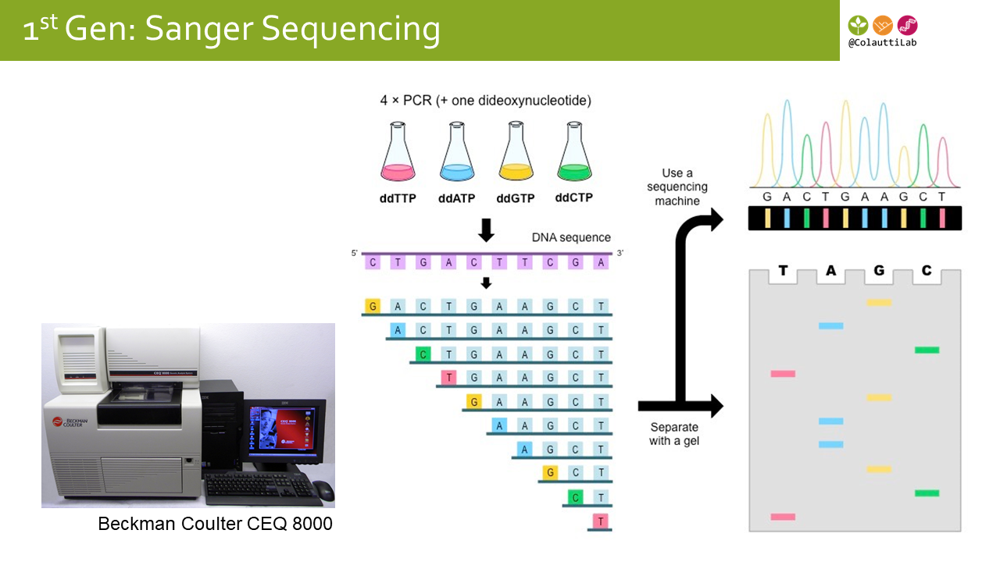
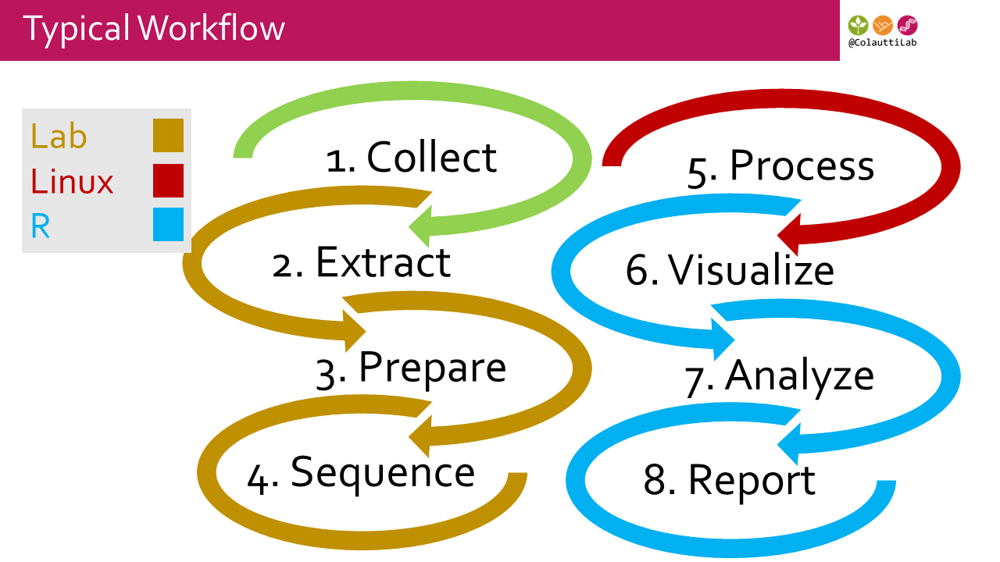

# Schedule

| Time  | Activity    |
|-------|-------------|
| 07:30 | Breakfast |
| 08:30 | Introduction & R Tutorials |
| 11:00 | Field Activity  |
| 12:00 | Lunch |
| 13:00 | Field Activity  |
| 14:00 | Group presentations (4x10 min) |
| 14:40 | Methods & Applications |
| 15:30 | Transcriptomics Rapid Tutorial |
| 16:00 | Metagenomics Rapid Tutorial |
| 16:25 | Nanopore Sequencing Demo & Wrap-up |

# Preparation

  1. Install [R](https://cran.r-project.org)
  2. Install [R Studio](https://www.rstudio.com/products/RStudio/#Desktop) (The free' desktop' version)
  3. Open R-Studio and locate the 'Console' panel
  4. In the console type `install.packages("___")` but replace `___` with the package name to install. Repeat for each of these packages:
    * tidyverse
    * knitr
    * vcfR
    * pinfsc50
    * rmarkdown
    * ggplot2
    * vegan
    * RAM
    * lmtest
    * car
    * coefplot

# Photo sharing

[Upload](https://smugmug.com/upload/wv8Rkz/LSETACQUBS2018) your field photos.

[Download](https://www.smugmug.com/gallery/n-DzQqQk) photos from other participants.

The password is: _LSETAC-QUBS2018_

# QUBS

  * Main [website](https://qubs.ca)
  * Topographical [maps](https://qubs.ca/resources/maps) (not high-res)
  * Lougheed [presentation](./FieldMethods/2_QUBS.pdf)

# Introduction

  * Research background and course expectations [presentation](./FieldMethods/1_Intro_SETAC.pdf)

## Code of Conduct

In this course we follow a code of conduct based on [The Carpentries](https://docs.carpentries.org/topic_folders/policies/code-of-conduct.html).

They can be summarized by two __Main rules__:

  1. Be professional
  2. Be inclusive

Zero-tolerance policy: __Harassment__ is any form of behaviour intended to exclude, intimidate, or cause discomfort. Because we are a diverse community, we may have different ways of communicating and of understanding the intent behind actions. Therefore we have chosen to prohibit certain forms of behaviour in our community, regardless of intent. Prohibited harassing behaviour includes but is not limited to:

  * written or verbal comments which have the effect of excluding people on the basis of membership of a specific group (ethnicity, religious belief, gender, sexual orientation, etc.)
  * causing someone to fear for their safety, such as through stalking, following, or intimidation
  * the display of sexual or violent images
  * unwelcome sexual attention
  * nonconsensual or unwelcome physical contact
  * sustained disruption of talks, events or communications
  * incitement to violence, suicide, or self-harm
  * continuing to initiate interaction (including photography or recording) with someone after being asked to stop
  * publication of private communication without consent
  
The list above should not be taken as exhaustive but rather as a guide to make it easier to enrich all of us and the communities in which we participate.
  
# Programming Crash-Course

## Introduction to R

  1. [R Fundamentals](.RCrashCourse/1_fundamentals.html)
      + Fallopia community ecology experiment [Data](./FieldMethods/Data/FallopiaData.csv)
      + Test your [R knowledge](./RCrashCourse/1_fundamentals_test.html)
  2. [Basic visualizations with `qplot()`](./RCrashCourse/2_qplot.html)
  3. [R Markdown](./RCrashCourse/5_advanced.html#2_r_markdown) 
      + [LaTeX cheat sheet](./latexsheet.pdf) for rendering equations in R Markdown
      + see also:
          + Very handy .Rmd [cheat sheet](http://www.rstudio.com/wp-content/uploads/2016/03/rmarkdown-cheatsheet-2.0.pdf)
          + Detailed .Rmd [website](http://rmarkdown.rstudio.com/lesson-1.html)
          + [R Notebooks](http://rmarkdown.rstudio.com/r_notebooks.html#overview)
  4. [Advanced visualizations with `ggplot()`](./RCrashCourse/3_ggplot.html)
  5. [Regular expressions](./RCrashCourse/4_regex.html)
      + Regex [cheat sheet for R](https://www.rstudio.com/wp-content/uploads/2016/09/RegExCheatsheet.pdf)
      + General regex [cheat sheet](https://www.cheatography.com/davechild/cheat-sheets/regular-expressions/pdf/)

## Introduction to Python

  1. [Python Fundamentals](./PythonCrashCourse/1_Fundamentals.html)
  2. Analysis [pipelines with python & snakemake](https://hpc-carpentry.github.io/hpc-python/)

## Linux/Command Line

  1. [Introduction to high-performance computing](https://hpc-carpentry.github.io/hpc-intro/)
      + Unix [cheat sheet 1](https://files.fosswire.com/2007/08/fwunixref.pdf)
      + Unix [cheat sheet 2](http://cheatsheetworld.com/programming/unix-linux-cheat-sheet/)
  2. Version Control with [Git & GitHub](http://swcarpentry.github.io/git-novice/)

## Applications Tutorials

  1. Transcriptome analysis [tutorial](./NGS/DifferentialExpression.html)
  2. Community ordination -- classic plant sampling [tutorial](./FieldMethods/Floristic_survey_analysis.html)
  3. Community ordination -- Operational taxonomic units (OTUs) from metabarcoding [tutorial](./FieldMethods/OTU_analysis.html)

## Guides to Reproducible Science

From the British Ecological Society

  1. [Data Management](./Readings/BES-Data-Guide-2017)
  2. [Reproducible Code](./Readings/BES-Reproducible-Code.pdf)
  3. [Getting Published](./Readings/BES-Getting-Published-Guide-2017.pdf)
  4. [Peer Review](./Readings/BES-Peer-Review-Guide-2017.pdf)

## Key points

  * R can be a powerful interface for 
    1. Managing data
    2. Analyzing data
    3. Visualizing data
    4. Generating dynamic reports
  * R can be slower or unusable for larger datasets (>> 1Mb)
  * Unix/Linux/Command Line programming is useful for working with large datasets

# __FIRST__ Generation Sequencing

Classic sequencing uses the Sanger method [(Wikipedia)](https://en.wikipedia.org/wiki/Sanger_sequencing).

__Step 1.__ Extract and Purify DNA

__Step 2.__ Select single target (e.g. PCR)

__Step 3.__ Dye-terminator PCR

__Step 4.__ Visualize on a gel

##  Protocol

Read through our [Quick Extraction & PCR Protocol](./FieldMethods/Protocols/PCR_Protocol.pdf)

> Draw a flowchart outlining the major steps.

Why is PCR necessary for Sanger Sequencing?



We don't have time to run through the protocol and sequenc samples. However, an undergraduate field course did this at QUBS a couple of weeks ago, so we can analyze their data. DNA was extracted from plants collected locally, used for DNA barcoding.

Sanger sequencing [analysis tutorial](./FieldMethods/DNAbarcodes.html)

> Try running through the tutorial with some of the other sequences. What species were found?

## Key points

  * Sanger sequencing is the 'classic' sequencing method
  * Gel can read only one target sequence at a time
  * DNA barcodes can be used to identify species
  * R can be a powerful interface for visualizing & analyzing sequencing data

# __SECOND__ Generation

## Typical Workflow



## Illumina Sequencing Overview


## 2nd Gen [Presentation](./FieldMethods/3_Sequencing.pdf)

## Key points

  * There are several flavours of 'next generation' sequencing (NGS)
  * NGS platforms sequence many fragments simultaneously, unlike the Sanger method
  * Sequencing technology is evolving faster than Moore's Law of computation
  * Dealing with billions to trillions of base pairs of data is not trivial
  * Bioinformatics is usually the bottleneck and main cost of a project involving NGS

# __THIRD__ Generation

[Nanopore MinION metagetnomics](./FieldMethods/DiscussionPapers/FieldMethodsNanopore_WIMP.pdf)

* [Output example #1](https://epi2me.nanoporetech.com/workflow/report_index/1582?token=C13185B8-3F0F-11E8-B528-07C0492C26E4;id_workflow_instance=164831&chain_component=2&rand=0.461169645637845#!/classificationWimp)
* [Output example #2](https://epi2me.nanoporetech.com/workflow/report_index/1569?token=07C73B18-4239-11E8-8CD3-08F2492C26E4;id_workflow_instance=165108&chain_component=2&rand=0.49242963976009#!/classificationWimp)

[What's in My Pot?](./FieldMethods/DiscussionPapers/Nanopore_WIMP2015.pdf)

  * Inspect the data on the [One Codex website](https://app.onecodex.com/projects/bb_minion_env)
  * Can be run in 'real time' (i.e. BLAST results as they are sequenced)

# Sequencing Comparison Table

```{r,echo=F,warning=F,message=F}
options(scipen=3)
options(digits=2)
library(knitr)
library(kableExtra)
SeqCmp<-read.csv("./FieldMethods/Sequencing_Throughput_Comparison.csv",header=T)
#SeqCmp$Gbp<-signif(SeqCmp$Gbp,3)
kable(SeqCmp) %>%
  kable_styling(bootstrap_options = c("striped", "hover", "condensed", "responsive"),full_width=F)
```

